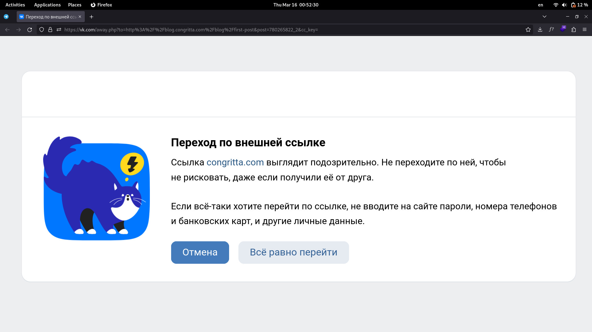
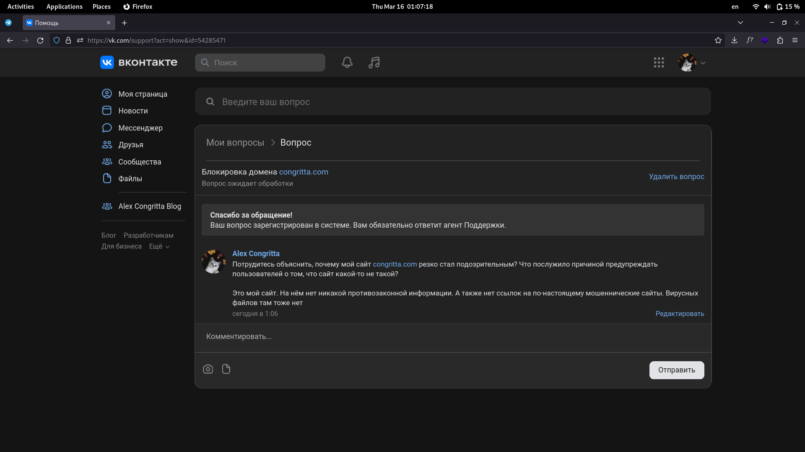
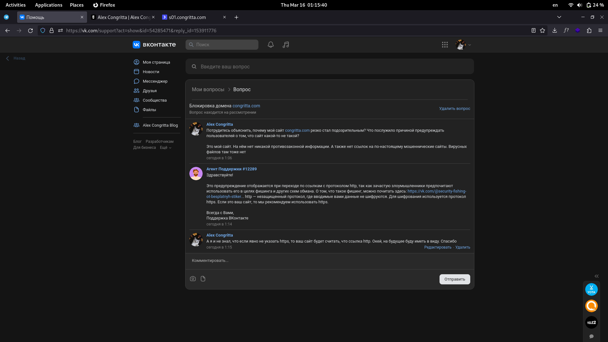

Вконтакте почему-то ни с того, ни с сего решил, что мой сайт congritta.com якобы мошеннический. Не совсем ясно, что послушило этому причиной. Ибо ссылок на вредоносные и запрещённые в РФ на моём сайте не было. Составлю тикет в поддержку, будем узнавать что не так

<!--truncate-->

---

**UPD:**

Поддержка ВКонтакте ответила за 6 минут. Это абсолютный рекорд. До этого обычно нужно было ждать сутки.

Оказывается, во ВКонтакте нельзя размещать ссылку без явного указания "https://", иначе система будет считать, что у сайта нет поддержки https, а значит - сайт потенциально опасен.

Впредь буду указывать все ссылки на свои сайты с протоколом "https"

