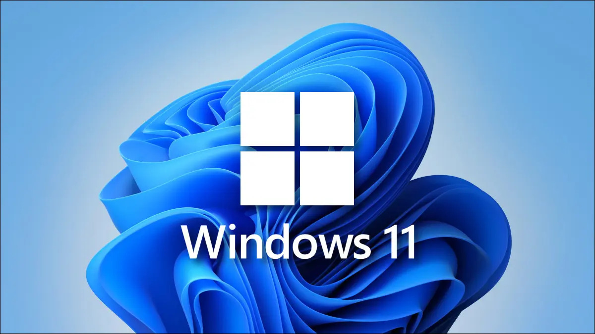

Я успел воспользоваться тремя популярнейшими ОС для компьютеров: Windows, ОС на основе Linux и Mac OS. В этой статье я попробую интересно и подробно рассказать об обыте использования каждой из них и подведу свой итог

<!--truncate-->

## Немного об ОС

### Linux

С детства (примерно с 2010 года) я отдавал своё предпочтение семейству Linux. Меня с этой ОС познакомил мой учитель информатики в школе. Он тогда устанавливал на все компьютеры ОС Ubuntu 10.04, аргументируя это тем, что школе не нужно выделять бюджетные средства на покупку Windows для каждого компьютера. Все последующие уроки информатики у нас проходили на Ubuntu вместо Windows.

Разумеется, как и все школьники, я сразу начал фанатеть от того, что если ты используешь Linux (Ubuntu, Fedora, CentOS - не важно, я дальше буду говорить просто Linux), то ты сразу становишься круче в глазах своих друзей. А если ещё овладеешь терминалом...

Несколькими месяцами позже я установил Ubuntu на домашний компьютер второй ОС и стал погружаться в идеологию Linux. Оказывается, Linux изначально создавался как доступная ОС для любого компьютера, будь то персональный, домашний компьютер или рабочая станция. До него был Unix, но у него был закрытый исходный код и был он доступен далеко не каждому. **Linux не сделан на основе Unix, это две в корне разные ОС**. Кстати мало кто знает - слово Linux являлось насмешкой над [Линусом Торвальдсом](https://ru.wikipedia.org/wiki/%D0%A2%D0%BE%D1%80%D0%B2%D0%B0%D0%BB%D1%8C%D0%B4%D1%81,_%D0%9B%D0%B8%D0%BD%D1%83%D1%81) (создателем этой ОС) от его одногруппника, сам Линус не очень любил название Linux.

Позже в игру вошёл [Ричард Столлман](https://ru.wikipedia.org/wiki/%D0%A1%D1%82%D0%BE%D0%BB%D0%BB%D0%BC%D0%B0%D0%BD,_%D0%A0%D0%B8%D1%87%D0%B0%D1%80%D0%B4_%D0%9C%D1%8D%D1%82%D1%82%D1%8C%D1%8E). Он стал продвигать идею свободного программного обеспечения и лицензию [GNU](https://ru.wikipedia.org/wiki/GNU), согласно которой, весь компьютерный софт должен быть свободен в распространении, иметь открытый исходный код и быть бесплатным.

Идея свободы и открытости зацепила многих людей, начинающих работать на Linux. Ты, мол, получаешь бесплатно ОС и все программы к ней, а ещё и имеешь доступ к их исходному коду. Ты всегда можешь взять исходный код нужной тебе программы, поменять его под себя и скомпилировать свою идеальную версию программы.

На момент даже 2010 года в мире расплодилось более тысяч различных ОС на основе Linux (дистрибутивов). Принципиально они ничем не отличаются - максимум набором установленных программ и настройками графического окружения. Однако есть и специализированные Linux-дистрибутивы, где, например, все файлы ОС (кроме домашней папки) доступны только на чтение. Это означает то, что никакая программа, будь у неё хоть права root, не сможет вмешаться в работу ОС и изменить какие-либо файлы в ней.

### Windows

Первый раз в жизни, когда я воспользовался компьютером, был в 2006 году. На нём стояла Windows XP. Однако ОС на нашем домашнем компьютере устанавливалась "компьютерным мастером", поэтому оригинальной версии Windows XP я не застал.

В 2012 году мой отец купил себе ноутбук и на нём стояла Windows 7. Тогда я с ней впервые познакомился. Да, я начал пользоваться Windows 7 после того, как уже освоил Linux. Примерно в то время у меня появился уже мой личный персональный компьютер. Уже тогда я впервые в жизни задумался о выборе ОС - Windows или Linux; причём в октябре выходила Windows 8 и у меня была трилемма. В итоге я поставил две ОС на один компьютер - Windows 8 и Ubuntu 12.04. Ubuntu 12.04, кстати, тогда перешла на новую графическую оболочку Unity.

Да, детства у меня не было.

В июле 2015 года вышла Windows 10. Microsoft тогда сказала, что это последняя версия Windows и Windows 11, 12, 13 не будет. В то время поднялся нехилый скандал мол как же так, Windows следит за своими пользователями и сливает в Microsoft всё возможное: контакты, список установленных программ, пароли от сайтов, пароли от WiFi и многое другое. При этом эти же люди спокойно пользовались Android и не брезговали, что Google берёт у них ровно ту же информацию, но со смартфона.

Тогда многие, кто знал Linux, ещё сильнее его полюбили, т.к. Linux никуда не сливает данные своих пользователей и устанавливали его себе чисто из принципа.

Windows 8 и 10 стали нелюбимыми версиями Windows. Ведь тогда Microsoft начала пичкать эти ОС ненужным мусором и неудобным, непривычным функционалом. Меня самого возмущало, что из Windows вырезали стандартную программу для просмотра картинок и заменили её другой, более тяжёлой, которая открывается по полгода. Я тогда сделал так, чтобы у меня все картинки открывались в Paint, который открывается моментально и там же можно быстро увеличить/уменьшить картинку.

Казалось бы, если ты не играешь в игры и не пользуется специфическим софтом, то тебе надо при первой возможности поставить Linux. Ведь там всё работает быстро, нет предустановленного мусора, "нет вирусов" и т.д. и т.п. Одни плюсы.

### Mac OS

Про Mac OS мало что могу сказать. Им я начал пользоваться только в Январе 2022, когда мне на работе выдали MacBook для работы. Лично мне, как программисту, не составило труда перейти на Mac OS, т.к. там используются многие Unix-like-фишки, которые есть и в Linux. В том числе тот же Терминал с теми же командами. Но мне Mac OS не нравится тем, что там слишком всё вылизано. Да, там всё работает, работает красиво и плавно, но иногда привычные тебе действия делаются в большее количество кликов, чем если это делать в Windows или в Linux.

## Проблема Linux и открытого ПО

Открытое ПО пишется энтузиастами. За свои труды они, чаще всего, не получают никакого поощрения, поэтому зачастую есть очень мало мотивации работать. И ещё меньше мотивации делать качественно, т.к. за качество тебя никто ругать не будет, но и никто не доплатит. Поэтому открытое ПО не отличается высоким качеством работы и дизайна. Что касается дизайна, даже в 2023 году 80% всего, что есть в Linux, выглядит отвратительно, будто дизайнер всё таки был, но уволился ещё в 1995 году. Это очень отталкивает от работы и снижает мотивацию. Когда ты установил на свой компьютер Linux, он сразу визуально стареет лет на 10.

Вторая проблема в том, что на Linux всё работает "как есть". Если тебе повезло с дистрибутивом, пакетнымм менеджером и версиями установленных программ и библиотек, то всё у тебя будет работать ещё приемлемо. Но если в системе из коробки нет нужной библиотеки или она работает криво, то и сами программы будут работать криво.

Возьмём GNOME. Это одна из самых популярных графических оболочек, но у него есть огромное количество проблем. Наприсер сейчас GNOME занимаются тем, что переводят свои программы на графическую библиотеку GTK4 и эти программы выглядят уже хорошо. Но половина программ остаются на старых библиотеках GTK2 и GTK3, которые вообще никак не вписываются в дизайн современного GNOME и эти программы режут глаза.

Есть ещё такая "вечная проблема" с графическим сервером. В большинстве популярных дистрибутивах стоят два сервера - Wayland и x.org. Не буду сейчас рассказывать, что такое графический сервер и как он работает в деталях. Если коротко: графический сервер обрабатывает нажатия на кнопки, перетаскивание, управление открыми окнами и т.д. и т.п. Прикол в том, что x.org существует давно и все программы затачивались под него. Однако x.org уже давно считается устаревшим и дистрибутивы по умолчанию уже несколько лет используют Wayland. А на Wayland всё ещё всё работает через жопу и с костылями.

В итоге делать стабильно работающее ПО под Linux становится невозможно; по крайней мере на нативных графических библиотеках. Твоя программа будет работать более менее приемлемо, если она написана на кроссплатформенных движках (например [node-webkit](https://www.electronjs.org/) или хотя бы [QT](https://www.qt.io/)). По этой причине, в частности, под Linux не выпускают профессиональное ПО вроде Adobe Photoshop или AutoDesk AutoCAD, потому что заставить эти программы работать без сбоёв в разных диструбивах с разными библиотеками, графическими оболочками, графическими и звуковыми серверами, это отдельный геморрой, причём вселенской силы.

## Плюсы лицензионного ПО

ПО, которое стоит денег, реализовано качественно. Потому что если вы платите деньги за ПО, то на эти деньги содержатся программисты, тестировщики, дизайнеры и отделы контроля качества. Покупая программу у крупной компании, вы получаете качественно сделанное ПО и поддержку. Если в работе программы вы видите ошибки, вы всегда сможете обратиться в поддержку программы и она разрулит любые возникшие проблемы.

Поэтому все профессиональные программы стоят денег и зачастую стоят дорого. Но если вы профессионал, вам будет очень трудно работать профессионально без этих программ.

## Почему я задумался о переходе на Windows

> Только сейчас подумал, что если бы меня читали десятки/сотни тысяч людей, то статью бы восприняли за проплаченную Microsoft'ом. Честно заверяю, что Microsoft не стала бы обращаться ко мне, потому что мой блог, на данный момент, существует около месяца и меня читают меньше десятка людей. Никаких вознаграждений от Microsoft за всё время существования блога я не получал. Всё, что есть в статье, я пишу от себя лично и текст мне никто не присылал.

Несмотря на заезженные минусы Windows (вроде мусора в системе после установки, большого потребления системных ресурсов самой ОС, "более слабой защищённости от вирусов"), её плюсы по сравнению с Linux перекрывают для меня все минусы. Конечно я давно не пользовался Windows и смотрю на неё через призму ностальгии, но я знаю, что Windows делают высокооплачиваемые команды дизайнеров, программистов и тестировщиков. Я знаю, что если Windows установилась и не выдала ошибок - она будет работать на этом компьютере, пока я сам, своими руками, не сломаю её. Я знаю, что если я скачаю популярную программу или игру, я смогу просто установить её, не парясь с зависимостями и версиями зависимостей; она просто установится и начнёт работать.

Отдельно хочу сказать про дизайн: у Microsoft есть штат дизайнеров, которые придумывают дизайн для Windows. И кроме того, что этот дизайн намного красивее дизайна 95% Linux-дистрибутивов, он ещё составлен очень удобно для работы и не лишний раз не отвлекает. Красивый и современный дизайн вдохновляет делать красивые и современные вещи.

## Что мне мешает перейти на Windows

Linux очень удобен для разработки. И речь даже не только о мощной командной строке. Linux на домашнем компьютере и Linux на сервере - зачастую это один и тот же Linux, поэтому разработка ведётся сразу в боевых условиях. Если проект запустился на компьютере - с большой долей вероятности он запустится и на сервере, если конечно у него нет специфичных требований к ОС вроде библиотеки нужной версии;

Windows мне придётся готовить к тому, чтобы она стала пригодна для разработки. В частности мне придётся перевести всю систему на UTF-8, установить и правильно настроить Git, сделать правильную работу BASH, что-то порешать с FTP, SFTP, потому что проводник, насколько я помню, не умеет по ним подключаться.

Ну и, на конец, у меня могут быть обманутые ожидания. Чтобы установить Windows, мне придётся снести имеющийся у меня Linux и полностью форматировать диск. На установку Windows я потрачу несколько часов, потом ещё несколько часов я потрачу на настройку самой ОС и несколько часов на то, чтобы подготовить её к разработке. За это время я могу столкнуться с ошибками и багами, которые напомнят мне о реальном качестве работы Windows и мне придётся либо оставить всё как есть и терпеть, либо снова тратить минимум день, сносить всё, ставить заново Linux и не пользоваться Windows ещё 4 года.

А ещё я живу в такой части мира, которую сейчас ненавидит весь мир и Microsoft тут официально перестал поддерживать Windows. Поэтому в любой момент может быть такое, что Microsoft пришлёт обновление, которое сделает компьютер неработоспособным. Таких сюрпризов я не хочу

## Итог

Пойду поставлю скачиваться Windows, хуже уже не будет
