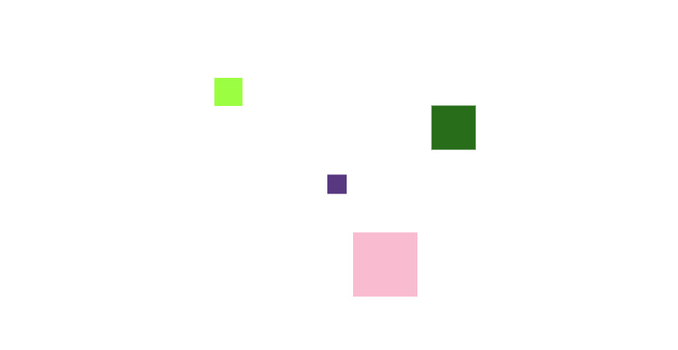

Написал минимальную браузерную игру на чистом JS с использованием Canvas. На её примере, в этой статье решил
рассказать, как вообще в принципе работают простые двухмерные игры

<!--truncate-->

Ссылка на видео, где я сделал игру от и до примерно за час: https://www.youtube.com/watch?v=okIqeF2g3OQ

## Пролог

Как-то раз вечерком общался с другом и он попросил меня рассказать о canvas. Я созвонился с ним, включил демо экрана
и показал ему основные приёмы работы с canvas и где и как они используются. Когда мы научились рисовать
прямоугольники и круги, мы задались вопросом: а как, собственно, двигать объекты на canvas, т.к. у них нет никакого
селектора и при помощи JS к ним никак обратиться нельзя. Для начала я просто реализовал такую штуку, где у нас рисуется
квадратик и мы можем двигать его при помощи клавиатуры. Позже родилась идея написать к этому всему мультиплеер, чтобы
на экране были разные квадратики и с разных браузеров можно было бы управлять ими.

## Немного о canvas

Canvas - это API браузера для отображения растровой графики. Эту самую графику можно генерировать при помощи
JavaScript. По сути Canvas даёт нам не много - у нас на всё про всё всего один слой. То есть если мы что-то
нарисовали, то вырезать этот нарисованный объект нельзя - можно только очистить область на нашем Canvas или весь его
полностью.

Не смотря на это, при помощи Canvas мы можем делать игры. Ничего не мешает нам написать простенький игровой движок
(что я и сделал), чтобы мы могли создавать объекты и менять у них координаты. Вот как это работает:

1. Для каждой игровой сущности мы создаём свой класс. В примере на видео, я создал класс `Square`, который брал на себя
   все операции по отрисовке одного квадрата. У него создаётся метод render, который тупо рисует квадрат по заданным
   координатам;
2. Понятное дело, что если просто поменять у класса свойства "x" и "y", ничего не изменится, т.к. мы просто поменяли
   значения в переменных, но не попросили canvas перерисовать квадрат. Повторюсь, что мы не можем попросить canvas
   переместить объект, поэтому мы вынуждены очистить наш холст и рисовать квадрат заново. Чтобы это работало каждый
   кадр, мы используем JavaScript-функцию `requestAnimationFrame` и передаём в неё функцию, которая будет отвечать
   за перерисовку. Она чистит весь canvas и рисует квадрат заново (вызывает метод render у объекта Square). Сама
   функция `requestAnimationFrame` очень полезна, т.к. через неё мы можем попросить браузер вызывать коллбэк каждый раз,
   когда он соберётся перерисовывать страницу (то есть, грубо говоря, каждый кадр);
3. Теперь мы можем просто поменять свойства "x" и "y" у квадрата и он автоматически "переместится" (то есть исчезнет
   из холста и будет нарисован по другим координатам и это происходит моментально);

## Управление с клавиатуры

Тут всё просто. При инициализации класса мы вешаем обработчик события `keydown` на объект window и при нажатии
клавиш "w", "a", "s", "d" двигаем квадрат (меняем свойства "x" и "y")

## Мультиплеер

В нём ничего сложного. При заходе на страницу в браузере мы соединяемся с сервером и "регистрируемся" там (то есть
генерируем размер и цвет квадрата на клиенте и отдаём на сервер, а он сохраняет это к себе).

Если мы перемещаем квадрат, отправляем запрос на сервер, а он рассылаем всем клиентам сигнал, что такой-то клиент
переместил свой квадрат.

Если мы покидаем игру (отключаемся от сервера по каким-либо причинам), то также рассылаем всем клиентам сигнал, а
они уже перестают рендерить квадрат вышедшего клиента.

## Немного о других играх

По сути то, что я написал - это простая реализация мультиплеера, которая также применяется и в других играх. Чаще всего
для работы игровых серверов используют протокол TCP (и уже пишут свой протокол поверх него). Клиент и сервер могут
общаться между собой при помощи JSON или XML. В своей игре я использовал протокол websocket, который работает поверх
HTTP, который работает поверх TCP

## Исходники

FrontEnd: https://github.com/congritta/game-frontend  
BackEnd: https://github.com/congritta/game-backend
