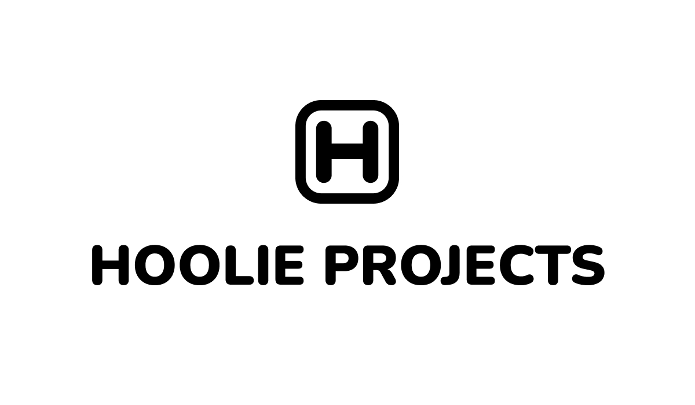

**Hoolie Projects** - название моей веб-студии, которая существует, между прочим, больше года. Это моя карманная
веб-студия, она работала только тогда, когда мне надо. И было проще делегировать часть работы на неё и выступать от
её имени. В этой статье я в подробностях расскажу о Hoolie

<!--truncate-->

## Предыстория

Я занимаюсь программированием с 2009 года. А фрилансом занимаюсь с 2016 года. Конечно, как и любой начинающий
фрилансер, я всегда выступал от своего имени и занимался проектами заказчиков самостоятельно, складывая на себя
обязанности и FrontEnd-разработчика, и BackEnd-разработчика. Иногда заказов вообще не было и приходилось неделями
сидеть без работы, но иногда заказов было столько, что меня чисто физически не хватало на их всех и приходилось
отказывать новым заказчикам, теряя их.

Когда растёшь и работы становится слишком много для тебя, было бы неплохо найти ещё разработчиков и отдавать работу
им (либо делать одну работу вместе). А когда несколько разработчиков объединяются, они могут организовать свою
веб-студию. У меня было несколько попыток её организовать, но в силу слабого опыта и плохих навыков в менеджменте,
сделать это всё грамотно и успешно мне не удавалось.

## Чуть позже, чем предыстория

В январе прошлого года я понял, что мне редко попадаются серьёзные заказы, которыми можно было похвастаться. Поэтому
я решил заняться пет-проектами (что это такое, я рассказывал [тут](./why-pet-projects)). Во время создания первого
пет-проекта я делал подвал и нужно было туда впихнуть копирайт. Тогда я сразу подразумевал, что пет-проекты я повешу
на свою студию, поэтому надо вписать туда название студии. Его, разумеется, я тогда ещё не придумал, поэтому решил
вписать первое, что придёт в голову (таким образом, кстати, я придумываю реально красивые и необычные имена чему-либо).

А первое мне пришло в голову слово "проект". А что проект? А с хуя ли проект? А хули проект? О! Хули Проект. Или
**Hoolie Projects**. А что, красивое название. Может кому-то покажется неприличным и быдловатым, те могут называть
"Хулай". Я не отношусь негативно к вещам, если в них нет ничего плохого. Например к нецензурной лексике. На ней
говорят и подростки, и взрослые, на ней говорят все. Так почему бы и нет?

## История

Зимой прошлого года и до 6 марта я работал в штате разработчиком. Несмотря на это, идея о создании своей веб-студии
от меня не отлипала. Увы, работать на основной работе и параллельно крутить веб-студию я не мог.

В конце зимы прошлого года у нашей компании начались проблемы, т.к. было затруднено сотрудничество с Европейскими
компаниями, на котором она жила. Несколько дней спустя, у нас прошла волна сокращений, под которую попал я и ещё
несколько разработчиков. В тот же день, стоя около входа в бизнес-центр, где был наш офис, я решил, что сейчас самое
время заняться веб-студией.

10 марта 2022 года я зарегистрировал домен [hoolie.org](https://hoolie.org) и сделал лендинг своей студии. Он был
очень похож на тот, что есть сейчас, потому что тот, что есть сейчас, я делал по памяти.

По конец апреля прошлого года я занимался привлечением заказчиков, чтобы зарабатывать хоть немного на базовые расходы и
созданием пет-проектов. Уже в начале мая я нашёл первого заказчика и я полностью ушёл в работу с ним, оставив студию.

В середине лета, когда был завершён первый спринт по заказу, у меня появилось немного свободного времени, чтобы
подумать о дальнейших планах на свою жизнь. Тогда я понял, что снова не время заниматься студией, поэтому я решил
пока что выступать от своего имени.

С августа по конец октября у меня была работа с другим заказчиком и я снова выпал из этой вселенной и полностью
посвятил время и силы, чтобы работать с ним.

В ноябре я вновь освободился и решил продолжить задуманное. Я стал вновь делать пет-проекты.

И вот сейчас, в текущий период времени, я решил возродить свою студию. В ней будут участвовать разработчики,
дизайнеры и другие IT-специалисты, чтобы вместе создавать действительно крутые и современные онлайн-проекты.

## Планы

Я буду продолжать выступать как Alex Congritta, если я делаю что-то от себя сам. Если я работаю вместе со своей
командой Hoolie, я буду выступать как Hoolie Projects. Кстати, если вы хоть что-то умеете и хотите вступить в мою
команду, напишите мне. Это актуально даже если вы читаете эту статью спустя несколько месяцев или лет после её выхода.

Для Hoolie Projects я создал отдельный сайт, чтобы на нём простым языком рассказать, какие услуги мы оказываем и чем
вообще занимаемся. Мои сайты congritta.com и congritta.ru актуальны и продолжают работать.

Сюда, в этот блог я буду публиковать новости, связанные с развитием моей веб-студии. Возможно позже я заведу
отдельный блог и для неё
