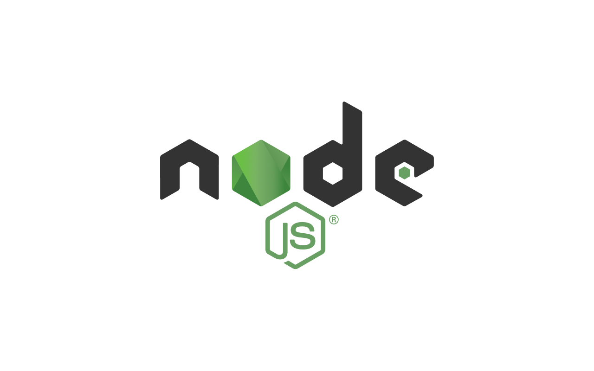
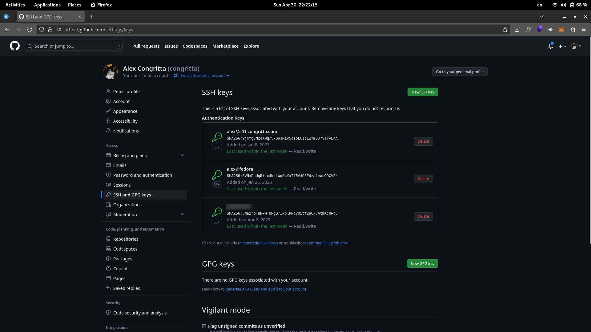
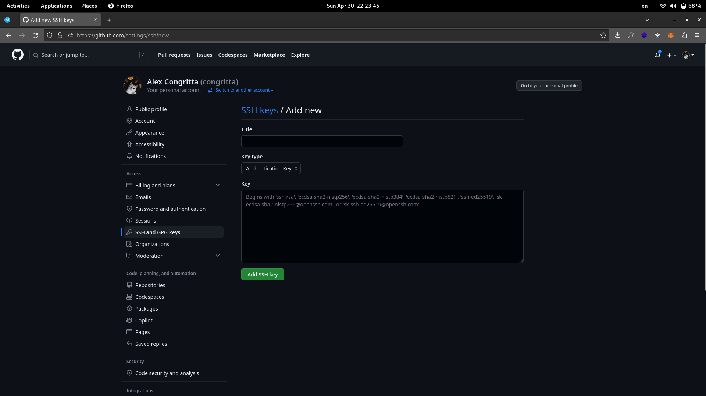
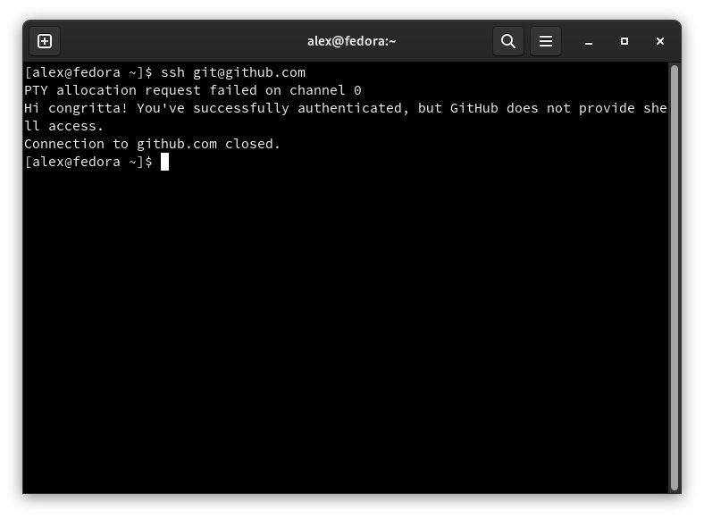
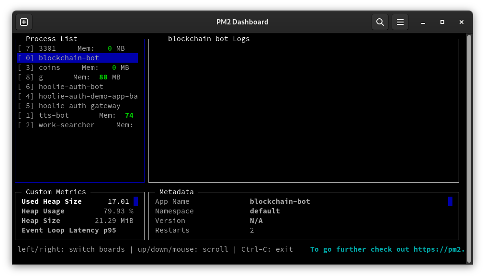

В интернете огромное количество статей по поводу запуска NodeJS-приложения на сервере. Но большинство из этих статей
доводят до того, что на сервере просто запускается приложение, при этом часто опускаются моменты с тем, как
заставить его запускаться вместе с системой, как распределять нагрузку и как сделать его отказоустойчивым.

В этой статье я выскажу свой многолетний опыт деплоя NodeJS-приложений (то, как это делаю именно я)

<!--truncate-->

## Подготовка приложения

Для начала приложение, конечно, нужно разработать. Если вы не знаете как сделать приложение на NodeJS - эта статья
не для вас. Возвращайтесь сюда, когда у вас на руках будет рабочий NodeJS проект.

## Синхронизация с GitHub

После того, как вы доделали ваше приложение, его исходники нужно выложить в GitHub или любой другой хостинг
Git-репозиториев

## Подготовка сервера

Многие VPS-провайдеры на этапе выбора ОС предлагают готовую сборку с установленным NodeJS, но более хорошим и
рациональным вариантом будет установка чистой ОС, а поверх неё всего необходимого.

После установки ОС сперва обновите её:

Если у вас Ubuntu:

```shell
sudo apt update && apt upgrade -y
```

Если у вас Debian:

```shell
apt update && apt upgrade -y
# выполнять под рутом
```

Если у вас Fedora, CentOS:

```shell
sudo dnf update
```

Далее, установите необходимые пакеты. Ибо неизвестно, насколько сырой дистрибутив вам дал ваш VPS-провайдер:

Если у вас Ubuntu:

```shell
sudo apt install -y curl wget git whois net-tools nano
```

Если у вас Debian:

```shell
apt install -y curl wget git whois net-tools nano
# запускать под рутом
```

Если у вас Fedora, CentOS, RHEL:

```shell
sudo dnf install curl wget git whois nano
```

Затем установите NodeJS. Команды для установки можно взять отсюда: https://github.com/nodesource/distributions.
Желательно не устанавливать NodeJS из репозиториев операционной системы, т.к. как правило, там устаревшие версии.

Кроме NodeJS установите yarn (если он вам нужен) и pm2

**Установка yarn (команды нужно выполнять под root):**

```shell
corepack enable # если не сработало, то: npm i -g corepack
corepack prepare yarn@stable --activate
```

**Установка pm2 (команду нужно выполнять под root):**

```shell
npm i -g pm2
```

Далее вам нужно создать пользователя, под которым будут запускаться ваши скрипты. **Нельзя никогда запускать скрипты
от имени пользователя root, т.к. в этих скриптах может сидеть троян, который может нанести пиздюлей вашей системе.
Поверьте, таких много**.

**Создать пользователя:**

```shell
useradd ИМЯПОЛЬЗОВАТЕЛЯ -m -s /bin/bash
```

**И сразу задайте ему пароль командой:**

```shell
passwd ИМЯПОЛЬЗОВАТЕЛЯ
```

**Если вы сидите под рутом, можно быстро переключиться на любого пользователя:**

```shell
su ИМЯПОЛЬЗОВАТЕЛЯ
```

**Чтобы перейти обратно на рута:**

```shell
logout # или сочетание клавиш Ctrl+D
```

Есть ещё такая штука, что у пользователя будет старая версия yarn (начинается на "1."). Если это так, выполните под
пользователем команду:

```shell
corepack prepare yarn@stable --activate
```

Новые версии yarn на момент написания статей начинаются на "3."

### Выбор папки под проекты

Под хранение проектов можно выделить домашнюю папку пользователя или создать в любом месте папку и выдать права на
пользователя

## Импортируем проект из GitHub

Если ваш проект хранится в приватном репозитории (будь то GitHub, BitBucket, GitLab), вашему серверу нужно выдать
доступ в приватные репозитории. Проще всего это будет сделать через SSH:

**Генерируем SSH-ключ на сервере (если вы его ещё не создавали):**

```shell
ssh-keygen
```

Отвечаем положительно на все вопросы. Если хотите, можете задать пароль на ваш ключ во время его создания. Пароль
будет спрашиваться каждый раз, когда вы куда-то подключаетесь по SSH от имени вашего сервера.

Далее идём в настройки аккаунта на GitHub в раздел "SSH and GPG keys"



и нажимаем кнопочку "New SSH key"



Имя можете написать любое, а сам ключ можете получить этой командой:

```shell
cat ~/.ssh/id_rsa.pub # если вы выбрали стандартный путь при генерации ключа
```

Теперь сервер может видеть все ваши приватные репозитории. Можно так же указать ключ в настройках одного конкретного
репозитория, но GitHub почему-то не даёт возможности указать один и тот же ключ на несколько репозиториев. В итоге
либо один конкретный репозиторий, либо все сразу.

Чтобы проверить, есть ли у вашего сервера доступ к GitHub, выполните команду:

```shell
ssh git@github.com
```

После чего, если всё хорошо, GitHub скажет, что всё хорошо:



Для того, чтобы импортировать проект из GitHub:

```shell
cd ПАПКА_В_КОТОРОЙ_ХРАНЯТСЯ_ПРОЕКТЫ
git clone git@github.com:ВАШ_ЛОГИН/НАЗВАНИЕ_ПРОЕКТА
```

## Делаем автоматическую пересборку и перезапуск проекта при обновлении

В Git есть хуки. Это скрипты, которые выполняются, когда вы совершаете действие с репозиторием (например, делаете
коммит или делаете `git pull`).

Запишем хук `post-merge`, который будет срабатывать каждый раз, когда мы обновляем проект на сервере через `git pull`

```shell
nano ПАПКА_С_ПРОЕКТОМ/.git/hooks/post-merge
```

Записываем в файл следующее:

```shell
#!/bin/bash

cd ПУТЬ_К_ПАПКЕ_С_ПРОЕКТОМ \
&& yarn \
&& yarn build \ # если это предусмотрено в вашем проекте
&& (pm2 restart "НАЗВАНИЕ_ПРОЕКТА_КАК_В_НАЗВАНИИ_РЕПОЗИТОРИЯ" || \
  pm2 start yarn --name "НАЗВАНИЕ_ПРОЕКТА_КАК_В_НАЗВАНИИ_РЕПОЗИТОРИЯ" -- start)
```

При необходимости, если знаете BASH, можете переделать скрипт под себя

Закрываем редактор через `Ctrl+O`, `Enter`, `Ctrl+X`

Сделаем наш файл исполняемым:

```shell
chmod +x ПАПКА_С_ПРОЕКТОМ/.git/hooks/post-merge
```

Всё. Теперь, если вы что-то меняете в проекте, вы выкладываете изменения на GitHub, а потом заходите на сервер в
папку с проектом и делаете `git pull`, скрипт выше автоматически выполнится.

Чтобы выполнить этот скрипт принудительно, просто выполните этот файл. Очень полезно при первом запуске проекта на
сервере:

```shell
ПАПКА_С_ПРОЕКТОМ/.git/hooks/post-merge
```

## Добавляем проект в автозапуск

Тут нам поможет pm2. Если вы введёте:

```shell
pm2 status
```

Вы увидите состояние ваших запущенных проектов. Кстати pm2 может управлять не только NodeJS-проектами, но и любыми
другми, в т.ч. Python и PHP-проектами. Документация на [pm2.io](https://pm2.io)

А команда

```shell
pm2 monit
```

покажет полную информацию о запущенном проекте:



Так вот. pm2 умеет хранить состояние проектов (включены/выключены). Для этого нужно выполнить:

```shell
pm2 save
```

И чтобы при перезагрузке сервера запущенные проекты запускались, нужно выполнить

```shell
pm2 startup
```

## Чуточку масштабирования

Помните, что NodeJS не заточен под многопоточную работу. Если у вас на сервере 16 ядер, NodeJS будет оптимально
использовать только некоторые из них. К тому же если у вас в проекте используется база данных (или Redis), то одно
подключение к базе делится на весь проект. То есть да, если у вас высокая посещаемость, то сервер может работать
медленно, потому что тупо все запросы к базе летят через одно подключение, которое создаётся при запуске проекта.

Будет здорово, если вы, как разработчик, не пытались затачивать архитектуру вашего NodeJS-проекта под
многопоточность (не использовали модули `worker_threads` или `cluser`). Кодовая архитектура проекта должна быть
написана стандартным способом, расчитанная на один поток.

Прикол в том, что вам сам проект нужно запустить несколько раз. В разных экземплярах. То есть у них одинаковые
конфиги (в т.ч. подключение к базе данных), а различается только порт, на котором запущен HTTP-сервер. То есть мы
должны получить то, что любой из проектов готов принять запрос от клиента (браузера) и успешно обработать его.

Такое "горизонтальное масштабирование" в рамках одного сервера позволит лучше распределить работу проекта на ядра
процессора и избавиться от фатальных ошибок, которые убивают запущенный проект (в идеале в коде проекта
предусмотреть, чтобы таких ошибок не было). Это называется отказоустойчивость.

Далее нам нужно грамотно настроить Nginx

## Установка и настройка Nginx

Nginx нам нужен для того, чтобы привязать домен к конкретному NodeJS проекту. Если вы планируете использовать SSL
(HTTPS), то им должен заниматься Nginx; сам проект должен работать по обычному HTTP.

### Установим Nginx

Если у вас Ubuntu:

```shell
sudo apt install -y nginx
```

Если у вас Debian:

```shell
apt install -y nginx
# выполнять под рутом
```

Если у вас Fedora, CentOS:

```shell
sudo dnf install nginx
```

Если вы хотите SSL (HTTPS), листайте вниз или посмотрите содержание статьи

### Направляем домен на запущенный NodeJS проект

Убедитесь, что на данном этапе знаете, на каком порту запущен ваш NodeJS-проект.

Идём в папку с конфигами Nginx:

```shell
cd /etc/nginx/sites-available
```

Если у вас такой папки нет, то тут дела обстоят сложнее. Возможно это папка `/etc/nginx/conf.d`. Если и это не
сработает, то загуглите этот момент или установите Ubuntu на сервер.

В папке с конфигами создаём текстовый файл, который нужно назвать как-нибудь по-английски (я обычно называю его
названием домена). В некоторых случаях nginx захочет, чтобы название файлов заканчивалось на `.conf`, поэтому для
перестраховки можете добавить в конце `.conf`

```shell
nano /etc/nginx/sites-available/ДОМЕН_САЙТА.conf
# выполнять под рутом
```

Пишем в файл следующее:

```text
upstream myproject {
  server 127.0.0.1:8000;
  # здесь список локальных адресов ваших запущенных NodeJS-проектов
}

server {
  listen 80;

  server_name СЮДА_ДОМЕН_САЙТА;

  location / {
    proxy_set_header  X-Real-IP             $remote_addr;
    proxy_set_header  X-Forwarded-For       $proxy_add_x_forwarded_for;
    proxy_set_header  Host                  $http_host;
    proxy_set_header  X-NginX-Proxy         true;
    proxy_pass        http://myproject;
    proxy_redirect off;
    proxy_buffering off;
  }
}
```

Закрываем редактор через `Ctrl+O`, `Enter`, `Ctrl+X`

Убедитесь, что ваш домен направлен на ваш сервер. Если вы не знаете, как это делается, то идите на сайт, где его
покупали и просите об этом поддержку.

Далее нам нужно активировать наш сайт. Для этого выполним команду:

```shell
ln -s /etc/nginx/sites-available/ДОМЕН_САЙТА.conf /etc/nginx/sites-enabled/ДОМЕН_САЙТА.conf
# выполнять под рутом
```

После чего проверим, что наш конфиг-файл написан правильно:

```shell
nginx -t
```

Если ошибки не повылетали, значит всё правильно и можно перезапускать Nginx:

```shell
systemctl reload nginx
# выполнять под рутом
```

С этого момента если вы зайдёте в браузер и введёте в адресную строку ваш домен, у вас должен открыться ваш
NodeJS-проект. Если это не так, мне очень жаль. Придётся перепроверять все свои действия, которые вы делали по этой
статье. Если совсем всё плохо, обратитесь к любому человеку, который уже всё это запускал.

## Делаем HTTPS

Для этого установите certbot. Эта штука автоматически установит SSL-сертификат и сделает всё как надо:

Если у вас Ubuntu:

```shell
sudo apt install -y certbot python3-certbot-nginx
```

Если у вас Debian:

```shell
apt install -y certbot python3-certbot-nginx
# выполнять под рутом
```

Если у вас Fedora, CentOS:

```shell
sudo dnf install certbot python3-certbot-nginx
```

После чего, выполните команду:

```shell
certbot
# выполнять под рутом
```

Если вы выполняете в первый раз, скрипт попросит вашу почту и согласие с использованием.

Далее скрипт выведет список всех сайтов, что нашёл в ваших конфигах. Вам нужно указать нужный сайт и дождаться
положительного ответа. После чего, ваш сайт теперь начнёт работать по HTTPS
