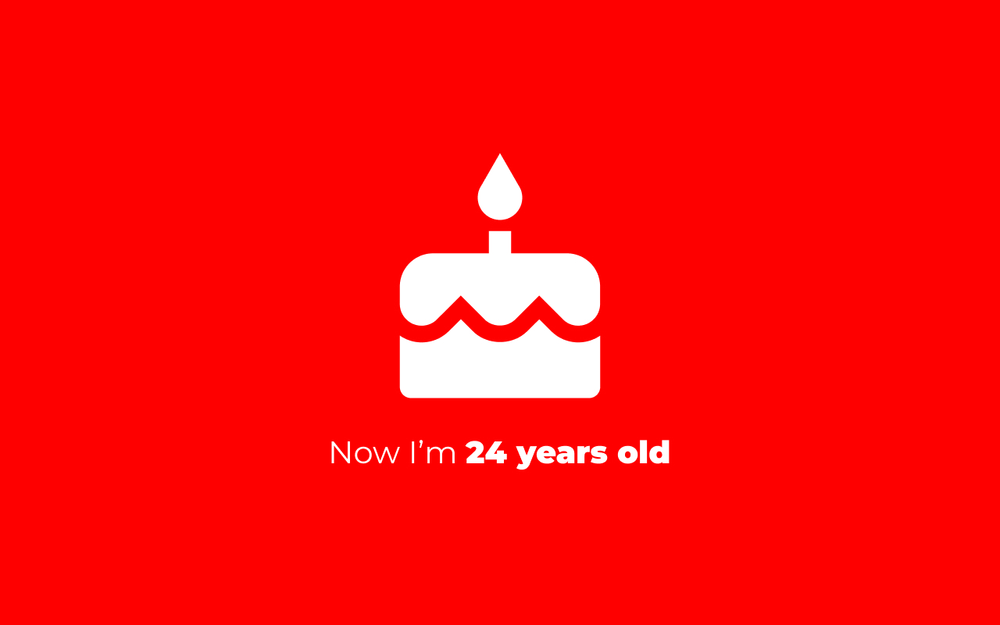
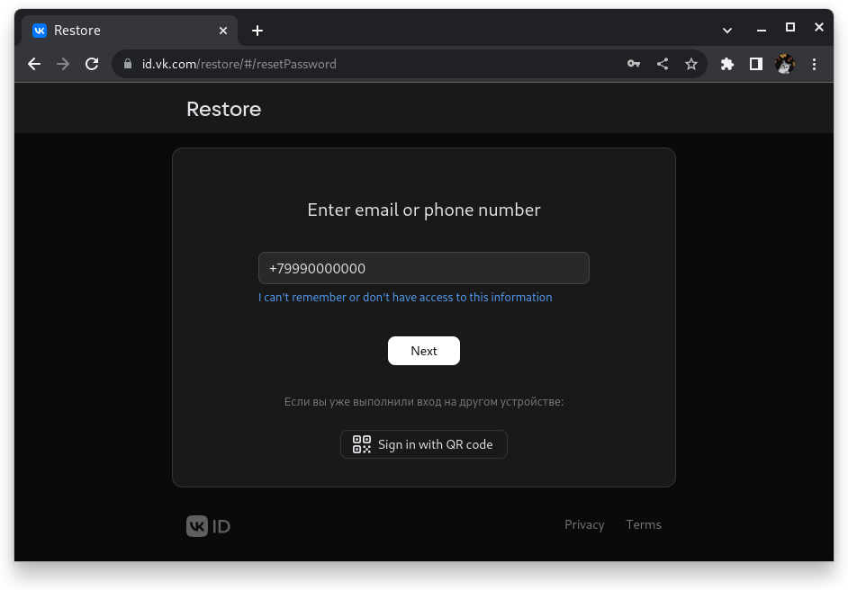
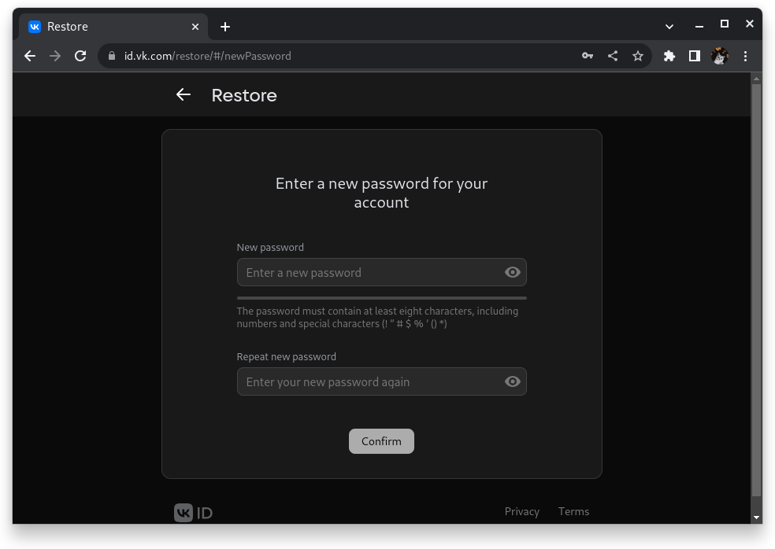
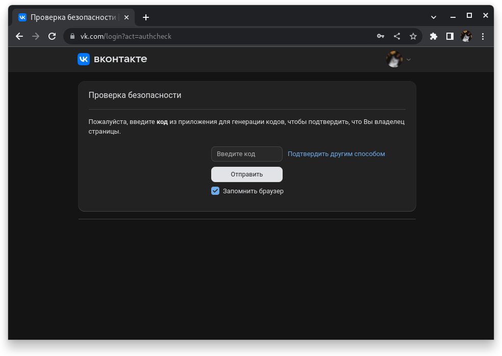
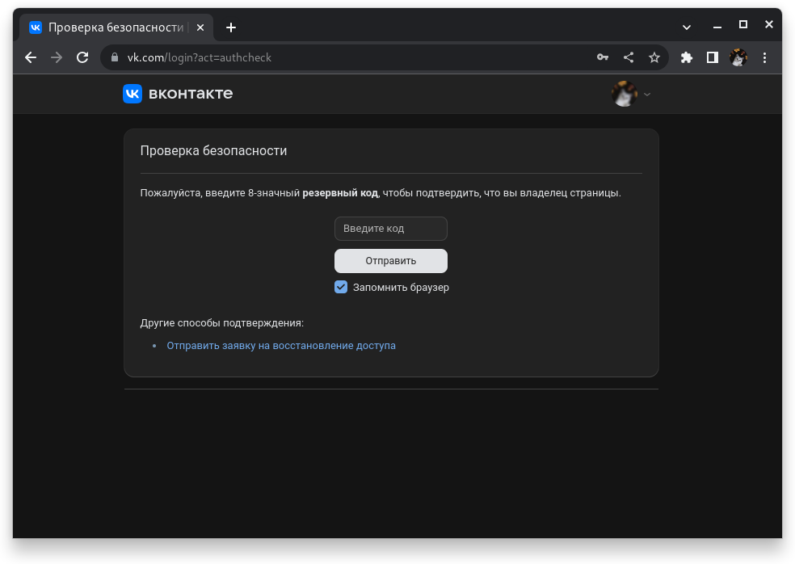
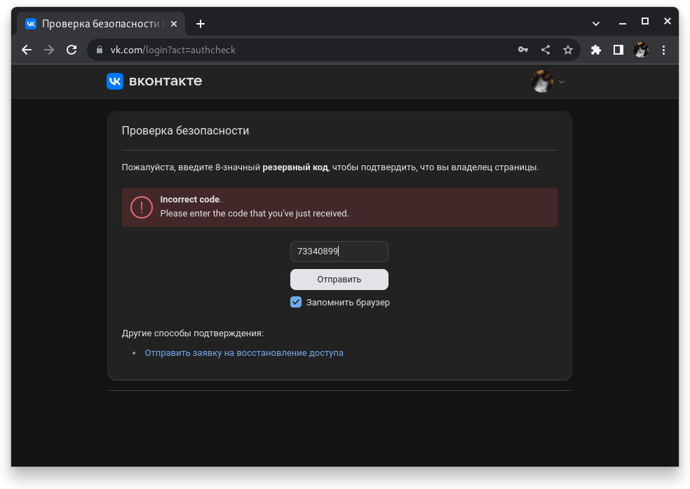

Недавно стартовал 25-й год моей жизни. В этом посте я подведу текущие итоги, расскажу о том, как из-за распиздяйства
разработчиков VK я потерял свой аккаунт и некоторые планы на ближайшее время

<!--truncate-->

## Мне 24

Недавно, 12 июля мне исполнилось 24 годика. Подумать только, я занимаюсь этим вашим IT уже почти 15 лет и не собираюсь
слезать с него. Хотя последнее время вынуждает меня ещё и тренироваться предпринимательству и менеджменту, т.к.
я фрилансер и, соответственно, сам себе и разработчик, и директор, и бухгалтер, и маркетолог. Это, кстати, неплохо так
тренирует по жизни - ты постоянно строишь стратегии, обращаешь внимание как действуют другие и к чему это приводит, ты
учишься на своих и чужих ошибках и, рано или поздно, таки достигаешь успеха (или, по крайней мере, утешительного приза).

В последний год своей жизни я заинтересовался криптовалютой и историей (это никак не связано, просто жизненные
обстоятельства привели к этому). И там и там мне стало впервые очень интересно, хотя долгое время я старался этого
избегать, т.к. считал это мегасложным и не моим. Криптовалюта (а точнее, её техническая реализация) дала мне понять,
как можно обычными компьютерными скриптами заставить миллионы людей сойти с ума и пошатнуть мировую экономику; хотя
ядром/сердцем/катализатором блокчейна, на котором держится криптовалюта, является обычное хэширование, которое было
изобретено давно и не является сложным для понимания. История же стала для меня крайне полезной, т.к. можно со стороны
понаблюдать за поведением людей (от организации племён и государств, до развязывания войн и революций). Изучая очередной
период истории, ты пробуешь думать, как бы ты сам поступил в той или иной ситуации, стал бы убивать того или иного царя,
напал бы на то или иное государство и к чему бы это могло привести. Это безумно помогает самому строить стратегии,
проводя аналогии и опираясь на чужой опыт.

Несмотря на то, что мне 24 и, казалось бы, треть жизни уже позади, я считаю, что время проведено не зря и каждый отрезок
времени я приношу сам себе что-то новое и полезное.

## Распиздяйство разработчиков ВКонтакте

(Лонгрид, сложно, лучше не читать).

На день рождения я купил себе новый смартфон. Ну и, конечно, начал переносить туда все свои файлы, контакты и прочее
прочее прочее. В т.ч. я решил перенести на новый смартфон генерацию кодов для двухшаговой авторизации (Google
Authenticator). Для этого я зашёл на все сайты, которыми я пользуюсь и переоформил приложение для генерации кодов на
новое, которое в новом телефоне. Коды, которые я перенёс, я удалял со старого смартфона, чтобы потом не забыть, какие
перенёс, а какие нет.

Наступила очередь для ВКонтакте. Для начала мне нужно было восстановить пароль, для этого я зашёл на vk.com/restore.

Указал свой номер телефона, получил код и указал его. Затем также получил письмо на почту и указал код от туда. Затем
Вконтакте попросил меня ввести код двухшаговой авторизации, я его ввёл и мне было предложено ввести новый пароль.

Именно в этот момент мне приспичило удалить генерацию кодов для ВКонтакте со старого телефона. После смены пароля
ВКонтакте
снова попросил меня ввести код двухшаговой авторизации, а... генерации кодов то уже нет. Приплыли.

Окей. Не забываем о том, что каждый сайт с двухшаговой авторизацией предлагает сохранить коды доступа **как раз на
случай, если мы потеряли приложение, которое нам генерирует коды**

Указываем, что будем вводить резервный код и вводим его

И ПОЛУЧАЕМ, СУКА, ОШИБКУ, МОЛ, "Введите код, который вы только что получили". А НАХУЯ Я ТОГДА ЭТИ ЕБАНЫЕ РЕЗЕРВНЫЕ КОДЫ
СОХРАНЯЛ.

Единственный способ, который остаётся, это подавать заявку на восстановления аккаунта. Но там нужно:

1. Фоткаться с паспортом;
2. На аватарке в соц. сети должно быть лицо и указаны настоящие имя и фамилия

То есть восстанавливать аккаунт по заявке совсем не вариант.

В итоге что? В итоге проебали аккаунт в "крупнейшей", по её словам, соц. сети в Европе. А из-за чего? А из-за того, что
дев отдел, видимо, даже не тестировал восстановление аккаунта по резервным кодам.

На самом деле, я не очень сожалею. Я не уважаю ВКонтакте и не веду там важные диалоги и в принципе не храню там ничего
важного. ВКонтакте был полезен для меня только в двух вещах: чтение постов Российских СМИ и пабликов и ещё то, что
через ВКонтакте очень удобно писать в поддержку вашего банка, мобильного оператора, доставки еды и т.д. - просто через
поиск ищете их паблик и пишете в личку. Как правило, это намного удобнее, чем общение с поддержкой в официальных
приложениях.

Обидно только за то, что я навсегда потерял доступ к паблику vk.com/congritta_blog и больше там посты выходить не будут.

Вот вам и урок: если у вас есть в собственности важные паблики, выдайте админский доступ вашим близким или сами
зарегистрируйте несколько аккаунтов и выдайте на них админский доступ

## Собираюсь продвигать блог

Моему блогу скоро будет полгода. Конечно, вам может быть неприятно, что посты в нём в среднем выходят раз в месяц.
Но, честно говоря, написание одного поста - это большие затраты по времени и силам. Мне бы хотелось, чтобы
мои посты были интересными и оригинальными. Я не хочу пересказывать популярные материалы из интернета, а хочу делиться
чем-то своим, личным, авторским. Иногда только на придумывание идеи для очередного поста может уйти несколько дней, ибо
помимо самой идеи, нужно в голове проанализировать, насколько о ней уже есть материалы в интернете, насколько
она будет интересна моим читателям и насколько я сам хорошо в ней разбираюсь.

К тому же надо постараться, чтобы написать сам пост - там не должно быть воды и повторений. Информация должна быть
структурирована и расчитана на то, что человек будет читать между абзацев.

За почти полгода я собрал только 9 подписчиков в своём Telegram-канале. Некоторых людей я приглашаю подписаться,
некоторые сами находят мой блог и подписываются. Заметил и такое, что люди отписываются от моего блога только потому
что мы давно не общались или наше общение закончилось не на позитивной ноте. Очень неприятно, что люди вкладывают
в подписку слишком много лирики и эмоциональных посылов. Ибо люди подписываются не потому что им интересно, а потому что
автор контента им знаком и полезно же иметь знакомого блогера. А если общение закончилось, то и зачем, мол, "мне
подписываться на него. Обойдётся. Пусть видит кого потерял".

На самом деле я хочу, чтобы люди были подписаны на меня только если им интересен мой контент и адекватно выражали свою
реакцию на него. Я не боюсь объективной критики и любой человек всегда может сказать мне что ему нравится или не
нравится. Понятное дело, что когда аудитории станет чуть больше, я буду опираться на то, какие посты чаще всего читают и
делятся ими. Пока аудитории мало, мне толком не нащупать почву и не понять, что нравится людям, о чём мне вообще писать
и на что делать упор.

Конечно я по большей части веду этот блог для души. Я не собираюсь делать из него ферму контента и зарабатывать на
рекламе, как это делают многие. Я хочу, чтобы у меня была своя аудитория, с которой я могу поделиться новостями или
мнением о чём-то и получить какой-то фидбэк.

Я долго думал по поводу того, чтобы купить где-нибудь рекламу. Самая главная трудность в том, что деньги у меня есть,
но я не рекламщик и, думаю, не смогу их с первого раза вложить грамотно. Пробовал общаться с таргетологами, но
они просят за свою работу слишком много. Почему-то исключается такой вариант - потратить на всё про всё 2-3 тысячи
рублей и просто посмотреть, как это вообще работает, сколько человек придёт и задержатся ли они.

Если внезапно вы таргетолог (или у вас есть знакомый таргетолог) и не против помочь мне в этом за символическую плату
или бесплатно, напишите мне. Я не против буду выпустить статью с вашим соавторством и рассказать людям о таргетированной
рекламе, а живым примером буду я. Думаю из этого может получиться что-то интересное.

## Ближайшие планы

Как и год назад, в начале лета у меня наплыв заказчиков, поэтому работы море и времени ни на что толком нет. Есть
множество идей для создания пет-проектов, которые хотелось бы реализовать (в т.ч. свой мессенджер, блоговая платформа,
ИИ-игры, финтех-проекты и т.д.). Есть так же несколько идей для бизнеса, которые можно будет попробовать ощупать
в ближайшие несколько месяцев. Есть даже идея поднять свой сервер Minecraft, но об этом позже.

В общем подписывайтесь на [Telegram](https://t,me/congrittaBlog) (пока это единственная платформа, где выходят анонсы
статей), ибо буду писать, если у меня в жизни произойдёт что-то интересное
