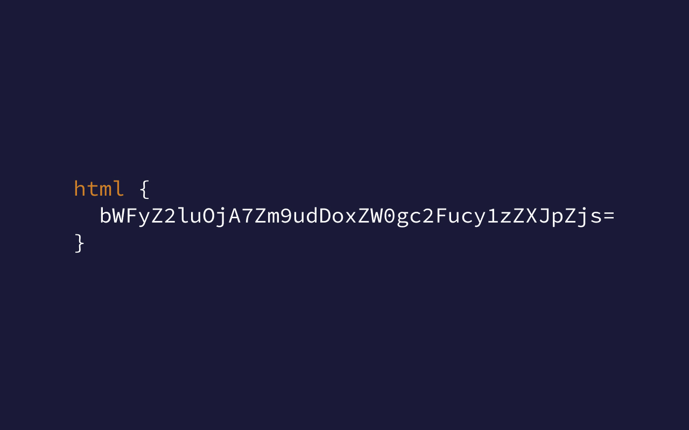
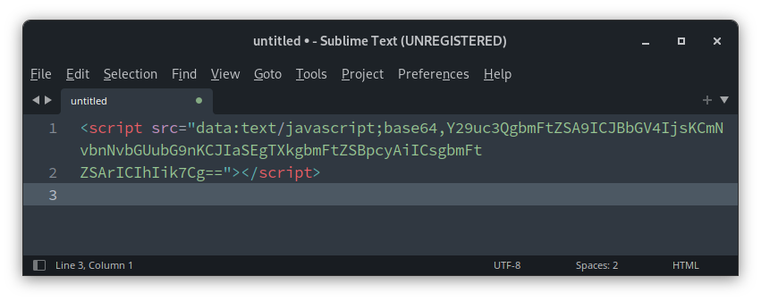
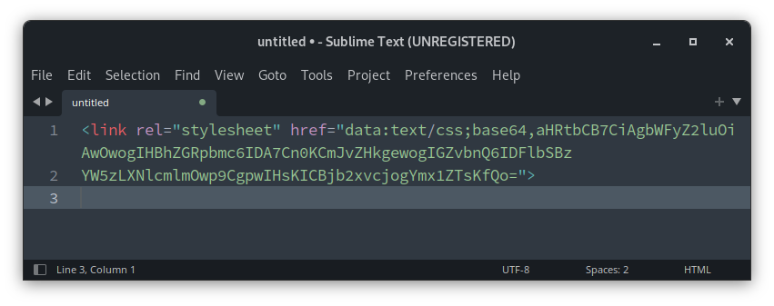
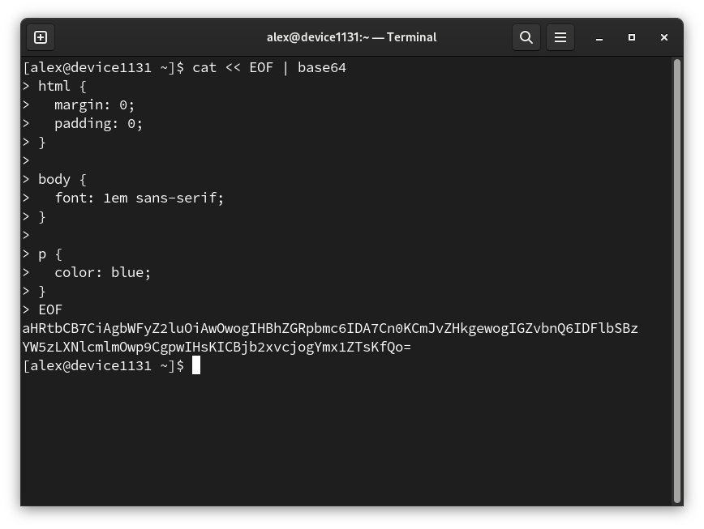

Есть малоизвестный способ "скрыть" CSS и JS-код на сайте. Может быть полезно, если вы не хотите, чтобы ваш код можно
было прочитать из инструментов разработчика в браузере. Однако при желании код всё равно можно прочитать, используя
несложные
консольные утилиты

<!--truncate-->

## Как выглядит "шифрованный" JS-код



Такой код будет работать, если вписать его в HTML любого сайта. Такое же возможно и с CSS:



Такое же можно применять в подключении чего угодно на сайт, в т.ч. картинок, SVG, шрифтов и т.д.

## Что это такое вообще

Это **Data URLs**, по сути виртуальные ссылки на что угодно (текст, HTML, CSS, JS, изображение, видео и т.д.); сам
контент хранится прямо в ссылке текстом или закодированным в base64. Вы прямо сейчас можете открыть новую вкладку у себя
в
браузере и набрать там:

```text
data:text/html,<h1>This is my site</h1>
```

Откроется страничка с заголовком "This is my site".

Почти все современные браузеры поддерживают Data URLs, но они редко используются, ибо прятать код особой нужды нет, а
контент можно
подгружать по старинке из сервера.

Data URLs можно использовать практически везде вместо обычных ссылок. Например:

```html

```

```css
ul.checklist > li.complete {
  margin-left: 20px;
  background: url('data:image/png;base64,iVBORw0KGgoAAAANSUhEUgAAABAAAAAQAQMAAAAlPW0iAAAABlBMVEUAAAD///+l2Z/dAAAAM0lEQVR4nGP4/5/h/1+G/58ZDrAz3D/McH8yw83NDDeNGe4Ug9C9zwz3gVLMDA/A6P9/AFGGFyjOXZtQAAAAAElFTkSuQmCC') top left no-repeat;
}
```

```javascript
window.open('data:text/html;charset=utf-8,%3C!DOCTYPE%20HTML%20PUBLIC%20%22-' +
  '%2F%2FW3C%2F%2FDTD%20HTML%204.0%2F%2FEN%22%3E%0D%0A%3Chtml%20lang%3D%22en' +
  '%22%3E%0D%0A%3Chead%3E%3Ctitle%3EEmbedded%20Window%3C%2Ftitle%3E%3C%2Fhea' +
  'd%3E%0D%0A%3Cbody%3E%3Ch1%3E42%3C%2Fh1%3E%3C%2Fbody%3E%0D%0A%3C%2Fhtml%3E' +
  '%0D%0A', '_blank', 'height=300, width=400');
```

(Примеры кода скопированы из статьи про Data URLs из википедии)

## Как создавать такие ссылки:

Любые такие ссылки составляются по такой схеме:

```text
data:[<MIME-тип>][;base64],<data>
```

То есть в начале пишем `data:`, дальше пишем MIME-тип. Его можно загуглить для нужного вам контента, но вот маленькая
табличка с популярными MIME типами:

| MIME-тип         | Описание      |
|------------------|---------------|
| text/plain       | Обычный текст |
| text/html        | HTML          |
| text/css         | CSS           |
| text/javascript  | JavaScript    |
| application/json | JSON          |
| image/png        | Картинка PNG  |
| image/jpeg       | Картинка JPG  |
| image/gif        | Картинка GIF  |
| image/svg+xml    | Картинка SVG  |

Далее сам контент. Текстовый контент можно писать прямо как он есть, либо, что лучше, закодировать его в base64. Для
этого гуглим
любой онлайн сервис, либо же, если у вас ОС на основе Linux, открываем терминал и пишем команду:

```shell
cat << EOF | base64
```

После чего пишем свой код и в самом конце нажимаем `Enter`, потом пишем `EOF`, потом ещё раз `Enter`.

Как это должно выглядеть:



То, что после EOF, это наш base64-код.

Вы так же можете создать текстовый файл и написать исходный код туда, а потом выполнить команду в терминале:

```shell
cat мойФайл.txt | base64
```

Полученный base64 мы добавляем в конец нашей ссылки. В итоге получаем

```text
data:text/css;base64,aHRtbCB7CiAgbWFyZ2luOiAwOwogIHBhZGRpbmc6IDA7Cn0KCmJvZHkgewogIGZvbnQ6IDFlbSBz
YW5zLXNlcmlmOwp9CgpwIHsKICBjb2xvcjogYmx1ZTsKfQo=
```

Если вам надо проверить работоспособность ссылки, просто откройте новую вкладку в браузере, вставьте ссылку в адресную
строку и нажмите Enter. Если всё откроется как надо, значит ссылка составлена правильно.

## А можно ли это расшифровать?

Можно. base64 легко расшифровывается любыми популярными языками программирования и встроенными консольными утилитами в
Linux.

Использование Data URLs поможет разве что защититься от некоторых парсеров сайтов, если у вас SPA (например если у вас
React с клиентской генерацией)
или если парсеры лезут в JS код. Но если у кого-то будет задача парсить именно ваш сайт, то использование Data URLs не
поможет
