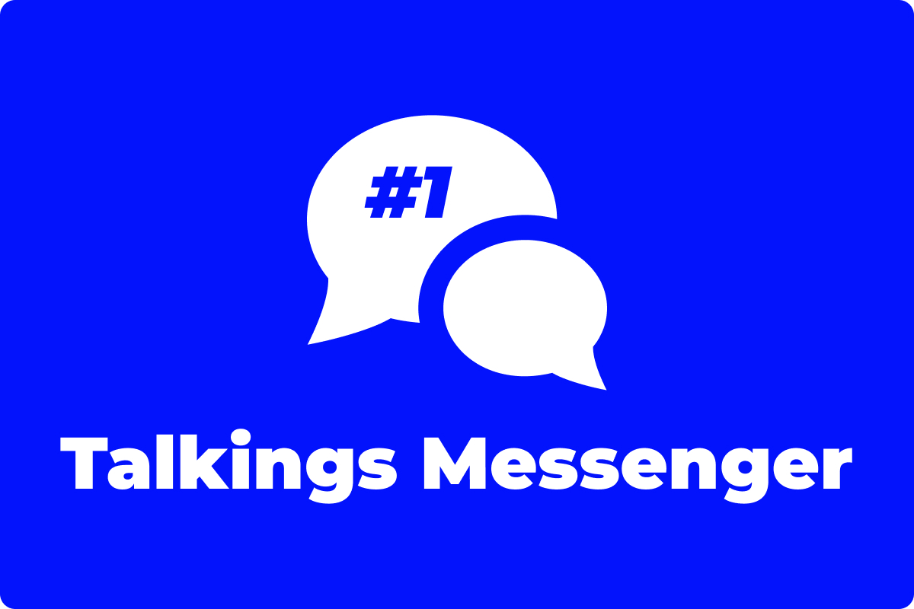

Задумался о создании своего мессенджера. Решил не просто втупую сделать ещё один проект, а детально объяснить как там и
что работает. Я открываю серию статей по разработке современного, функционального и стильного мессенджера. На его
примере я постараюсь объяснить, как реализуются функции хранения огромного количества сообщений, как реализуются
голосовые и видео сообщения, как работают эмодзи, стикеры и многое другое.

<!--truncate-->

:::warning
Проект закрыт и не обновляется. Возможно будет реинкарнирован
:::

## Пролог

Около восьми месяцев назад я уже запускал прототип своего мессенджера. Тогда там был реализован чисто фронтэнд на реакт.

На его разработку (как и на разработку других пет-проектов) я давным давно забил, потому что у меня уже несколько
месяцев сохраняется огромная загруженность по основной работе. Тем не менее, иногда бывают дни, когда хочется
расслабиться и поделать что-то для себя. А ещё у меня есть блог, в котором мне хотелось бы рассказывать, как работают
те или иные технологии, применяемые в веб (и нативных) приложениях. В итоге я решил это соединить и у меня родилась
гениальная идея:

## Суть

Я подумал, было бы круто начать разработку большого проекта и по ходу дела рассказывать как там что работает. То есть
это будет не просто статья о том, как сделать очередной чат на SocketIO, а будет целая серия статей, где я расскажу:

- Как продумать и правильно построить архитектуру проекта (в т.ч. какие языки и фреймворки выбрать для разработки
  проекта);
- Как организовать разработку проекта с точки зрения управления командой и процессами разработки;
- Как правильно настроить сервер, задеплоить проект и защитить его от атак;
- Как реализуются популярные функции в мессенджерах вроде смайликов, голосовых сообщений, звонков, стикеров и обмена
  медиафайлами;
- множество других технических аспектов.

Разработку мессенджера, разумеется, начну с нуля. Раз в иногда буду выпускать обновления мессенджера и писать статью о
том, что нового в обновлении и как я там всё реализовал. Чтобы обновления и статьи выходили чате, помогайте моему блогу
стать популярнее. Очень не хватает мотивации творить что-то грандиозное на аудиторию всего лишь из 8 человек.

## Первоначальные действия

Когда в голову пришла идея для стартапа (хотя наш проект не собирается быть стартапом, но я иногда буду его так
называть) и вы собираетесь приступить за реализацию, важно для начала сложить конкретную картину, что проект будет из
себя представлять. Вам важно понять, на какой функционал сделать упор, а какой функционал сделать базово с расчётом на
то, что в будущем вы легко его удалите, либо же будете дорабатывать до идеала.

Как вариант, вы можете обрисовать проект на листе бумаги или на компьютере открыть текстовый редактор и описать проект в
нём (есть так же различные конструкторы схем вроде ClickUp, Microsoft Whiteboard, Miro и др.). Если вы собираетесь
делать
проект как стартап, вам также нужно будет продумать и обрисовать бизнес-модель. Но я же собираюсь делать мессенджер как
пет-проект, поэтому о том, как выстроить бизнес-модель я расскажу как-нибудь в другом месте.

На данном этапе вы должны суметь чётко ответить на следующие вопросы:

- Какую задачу выполняет проект? (Какой его основополагающий функционал?);
- Что необходимо для старта разработки проекта? (Финансовые, временные, человеко- ресурсы);
- Какая архитектура, какой стек технологий будут выбраны для разработки проекта?
- Если в проекте принимает участие несколько человек, какие задачи и роль будут у каждого человека?

Сразу скажу, что в начале разработки проекта не нужно заморачиваться над неймингом и дизайном (если, конечно, вы не
дизайн-студия). Вам сперва нужно сделать минимальную рабочую версию продукта (MVP), грубо говоря,
на коленке, чтобы вообще вашу идею можно было пощупать и дать попробовать другим. Возможно какие-то вещи вы будете по 10
раз переделывать вам важно потратить на это минимальное количество времени и сил. Дизайн и название проекту можно
придумать в самом конце, когда в голове будет окрепший образ проекта и будет много времени подумать и пофантазировать.

## Написание ТЗ

ТЗ (техническое задание) - важнейшая составляющая любого серьёзного проекта. ТЗ максимально подробно и чётко описывает
то, каким будет проект, из чего будет состоять, как работает тот или иной функционал и т.д. и т.п.

Иногда только написание грамотного ТЗ может занять несколько дней или недель. Есть даже люди, которые занимаются этим
профессионально. Но если у вас маленькая команда и вы не собираетесь сразу же строить IT-империю, можно обойтись своими
силами. Главное, чтобы всей команде разработке было предельно ясно и не возникало вопросов.

## Планирование

Когда ТЗ написано, команда разработки готова и у вас есть все необходимые ресурсы для старта проекта, важно
распланировать вашу работу. Чаще всего
берётся [доска-канбан](https://ru.wikipedia.org/wiki/%D0%9A%D0%B0%D0%BD%D0%B1%D0%B0%D0%BD-%D0%B4%D0%BE%D1%81%D0%BA%D0%B0)
и для каждого человека распределяются конкретные задачи и сроки на ближайшее время.

Какие задачи делать взять в приоритет и делать первее - решайте сами. Если я буду в команде разработчиков проекта, я
смогу подсказать.

## О моём мессенджере

Если идея о серии статей зайдёт, то в следующей статье я подробно расскажу о проекте, какой функционал я собираюсь
там реализовывать и дам ссылку на ТЗ. Если хотите присоединиться к разработке проекта, пишите мне по доступным контактам
