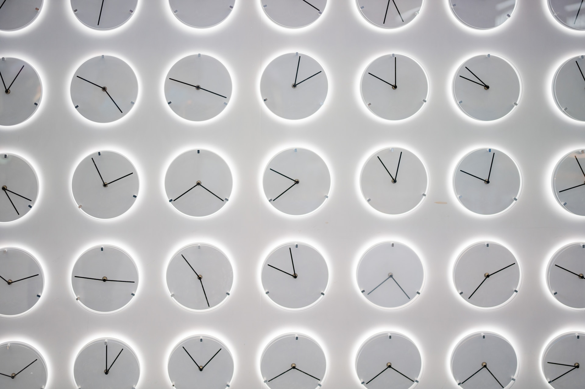

Как хранится время в компьютерах. Откуда сайты и приложения знают наш часовой пояс, чтобы правильно показывать время. Что такого случится 15 ноября 2023 года в 1:13:20 ночи по Москве. А ещё расскажу про проблемы 2000 и 2038 годов

<!--truncate-->

## О таймстемпах

Практически все компьютерные системы хранят текущее время в количестве миллисекунд, прошедших с [полуночи (с 03:00 по Москве) 1 января 1970 года](https://ru.wikipedia.org/wiki/Unix-%D0%B2%D1%80%D0%B5%D0%BC%D1%8F). Причём не важно в каком часовом поясе находится компьютер - информация о часовом поясе хранится отдельно и когда мы хотим получить текущий час, то компьютер автоматически добавляет нужное количество часов в зависимости от установленного часового пояса в настройках системы.

Например, день выхода этой статьи, 29 августа 2023 года 00:00 по Москве в виде таймстемпа будет выглядеть так: `1693267200000`

Ещё есть человекочитаемые таймстепмы ([стандарт ISO 8601](https://ru.wikipedia.org/wiki/ISO_8601)). Они могут выглядеть так: `2023-08-29T00:00:00.000Z`, так: `2023-08-29 00:00:00` или просто так: `2023-08-29`.

Время в таймстемпе практически всегда хранится без указания часового пояса.

Если мы говорим о базах данных (MySQL, MongoDB и т.д.) там есть свой тип данных, который называется _DATETIME_ (MySQL) или _Date_ (MongoDB). База данных сама решает, как хранить время, но может вернуть его как строку или как объект __Date__, если мы имеем дело с JavaScript. Базы данных умеют находить записи исходя из выборки дат (больше, меньше, равна и т.д.)

Когда на сайте нужно показать, допустим, дату создания аккаунта, то эта дата достаётся из базы данных в голом виде (без часового пояса) в виде таймстемпа и отправляется
к клиенту (в браузер или в приложение). Там средствами JavaScript к этому времени автоматически применяется часовой пояс компьютера. Затем мы выводим это время в обычный, понятный человеку вид.

## 1.7 трлн миллисекунд

Совсем скоро, 15 ноября 2023 года в 1:13:20 ночи по Москве будет 1.7 трлн (1700000000000) секунд, прошедних с полуночи 1 января 1970 года (GMT). Именно эта отметка будет на сотнях миллионах устройств по всему миру. Лично для меня, как для программиста, это очень значимое событие. По сравнению с ним, классический праздник наступления нового года ничего не значит.

1.8 трлн миллисекунд будет 15 января 2027 года в 11 утра по Москве. А 1.6 трлн миллисекунд было 13 сентября 2020 года в 15:26:40 по Москве.

2 трлн миллисекунд будет 18 мая 2033 года в 6:33:20 утра по Москве.

## Проблема 2000 года

Ссылка на статью в википедии, где описано более подробно: https://ru.wikipedia.org/wiki/Проблема_2000_года

В старых системах, которые существовали ещё в 20 веке, зачастую год указывался как его 2 последние цифры. Например: _01.10.86_. Многие программы были заточены под то,
чтобы определять год как раз таки по этим двум последним цифрам. Компьютеры в те года уже использовались в медицине, механизации, учёта сотрудников, инвентаризации и т.д. и т.п. Примерно в конце прошлого века многие люди обратили внимание, что когда наступит 2000 год, то везде год будет определяться как нулевой. Получится что-то типа: 29.08.00. Это грозило огромным сбоем в работе многих компьютерных систем по всему миру и проблему пришлось срочно решать.

До сих пор в JavaScript у объекта __Date__ есть 2 метода: `getYear` (возвращает текущий год - 1900 (такой небольшой костыль, специально для 1900-х годов)) и метод `getFullYear` (возвращает год нормально полностью)

## Проблема 2038 года

Ссылка на статью в википедии, где описано более подробно: https://ru.wikipedia.org/wiki/Проблема_2038_года

Дело в том, что числа в компьютерах, если они хранятся как числа, не могут быть слишком большими. В 32-битных системах максимальным чилом может быть _2^32_ или _4294967296_, т.к. в 64-битных - _2^64_ или _18446744073709551616_. 32-битные системы не могут хранить слишком большие числа и не могут понимать слишком большие таймстемпы (те, которые представлены числом). Поэтому наступление 2038 года (а точнее 19 января 2038 года, 06:14:07) может привести к ошибкам в работе самой ОС и имеющихся программ

## 1970 год и айфоны

[Источник](https://www.theguardian.com/technology/2016/feb/12/setting-the-date-to-1-january-1970-will-brick-your-iphone-ipad-or-ipod-touch)

В 2016 году по всему миру разлетелась новость о том, что если на iPhone выставить текущую дату так, чтобы она была раньше 1970 года, это ломало iOS и смартфон больше не включался. Починить такой iPhone можно было только механическим путём.

Думаю тут и так понятно, из-за чего эта проблема - получился отрицательный таймстемп и ОС, видимо, не понимала что происходит и как считать текущие дату и время.

## Проблема со сбросом времени при извлечении аккумулятора

Если вы помните, у старых смартфонов и телефонов при извлечении аккумулятора сбрасывалось текущее время. Это связано с тем, что текущее время хранится в материнской плате устройства и она запитана напрямую от аккумулятора устройства. Если плату обесточить - информация с неё стиралась, в т.ч. текущее время.

Современные смартфоны, ноутбуки и все устройства, которые умеют подключаться к интернету, для получения текущего времени обращаются к NTP-серверам, которые прописаны в настройках каждой современной ОС. ОС раз в иногда обращается к этим серверам, чтобы получить точное текущее время и мы, обычные люди, даже не задумываемся о том, а правильное время ли у нас стоит. В большинстве случаев, оно может быть неправильным если поменять настройки даты/времени и/или выставить неверный часовой пояс.
