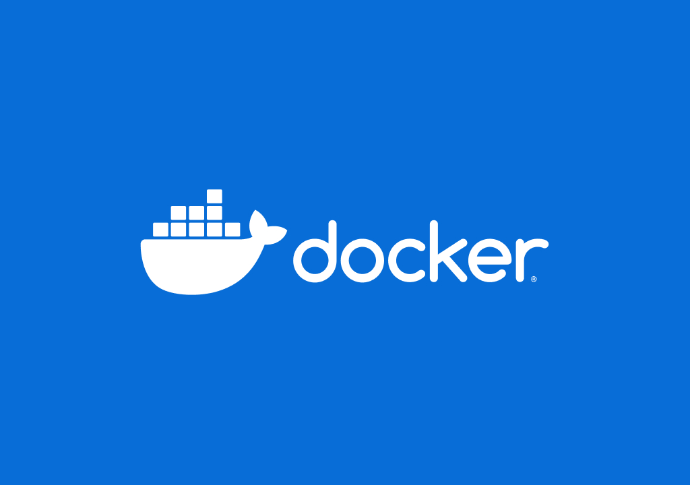

Docker - среда для контейнеризации приложений для развёртки на любой ОС. Нет, не так; Docker - штука, которая запускает
маленький (или не очень) Linux внутри вашей системы,
в котором крутятся ваше приложение и все зависимости к нему. Из контейнера как правило торчит TCP-порт, по которому
можно общаться с приложением и провести к нему Reverse Proxy.

В статье расскажу как правильно использовать Docker, чтобы вы об него не обожглись

<!--truncate-->

## Нахуя, а главное зачем

Если вы Fullstack или Backend разработчик, то вы прекрасно знаете, что у вас есть приложение, для работы которого на
сервер нужно устанавливать runtime (java, NodeJS, PHP и т.д.), СУБД (MySQL, Postgres, MongoDB), Redis, систему отлова
ошибок, кодеки (если ваше приложение работает с медиа) и т.д. и т.п.

Получается следующее: для работы вашего приложения нужно подбирать сервер с нужной ОС и устанавливать туда кучу
барахла (зависимостей), чтобы ваше приложение запустилось. Это не есть хорошо вот почему:

* Без докера придётся подбирать сервер именной с той ОС и с той версией зависимостей, чтобы запустить именно ваше
  приложение. Если вы работаете в команде или в компании, то просто так чистый сервер специально под вас вам никто
  не выделит;
* Если у вашего проекта несколько разработчиков, им придётся засирать свои рабочие компьютеры вашими зависимостями,
  чтобы запустить проект. Лично я брезгую устанавливать себе на компьютер кучу барахла ради работы одного проекта, над
  которым я не буду работать постоянно и/или на фултайме;
* Ваш проект тупо не запустится на сервере, если на нём глобально установлен, например, Node.JS версии 20, а под ваш
  проект требуется 16. Docker позволит на одном сервере держать NodeJS, MongoDB и другие зависимости разных версий и
  держать их запущенными одновременно, если оно требуется;
* Из-за того, что все докер-контейнеры в своём большинстве запускаются как Linux-среда (не важно, какая у вас хостовая
  ОС), то вы сможете протестить ваше приложение внутри Linux, если ваша хостовая ОС Windows

## Чем контейнер отличается от виртуальной машины?

* Контейнер использует ресурсы вашей ОС и делит их с ней (а точнее она с ним). Вам не придётся предвыделять контейнеру
  количество ядер, ОЗУ, места на диске. Он будет потреблять ровно столько, сколько потребляет само приложение внутри
  него.
  Из этого вытекает, что контейнеров даже на слабом компьютере можно запускать гораздо больше, чем виртуальных машин;
* Приложение в контейнере запускается и останавливается практически моментально. Не нужно ждать, пока ОС внутри
  контейнера
  запустится;
* Контейнер может делиться TCP (HTTP) портами и выплёвывать их в хостовую ОС. Вы сможете подключаться к контейнеру из
  хостовой ОС по адресу 127.0.0.1 или по любому другому адресу, что ведёт на вашу хостовую ОС. При этом сети между
  контейнерами можно объединять или изолировать. Таким образом, в контейнере можно запустить приложение и потом
  натравить
  на него Nginx или Apache (nginx и Apache тоже можно запускать в контейнерах если надо);

У Docker есть огромное количество [готовых контейнеров](https://hub.docker.com), на базе которых вы можете создавать
свои. Есть минималистичные контейнеры с минималистичным линуксом, на которых вы можете запускать что-то лёгкое,
а также есть контейнеры с полноценной Ubuntu внутри, чтобы установить необходимые системные библиотеки, кодеки и
запихнуть туда ваше приложение. В идеале нужно сделать так, чтобы приложение доставлялось на сервере в голом виде
(в виде исходного кода), а сборка/пересборка контейнера происходила непосредственно на самом сервере.

## Docker Compose

Docker Compose - просто бальзам на душу для тех, кто реально пытался упаковать своё приложение вместе с базой данных,
reverse-сервером и, например, редисом в один контейнер.

Docker Compose позволяет вам написать yml-файл, где вы описываете, что вообще представляет из себя ваше приложение
(а точнее его полный стек). В этом файле вы описываете, какие у вас есть зависимости и каких они версий (например
NodeJS v18.18.0, MongoDB 6.0, Redis 7.2) и вынести каждую зависимость в свой контейнер. У каждого такого контейнера
будут свои параметры, которые вы указывается в этом же файле (например порты или логин/пароль от базы данных).

Для исходников своего приложения вы пишете Dockerfile, который упакует его в нужный контейнер. Контейнеры могут
видеть открытые порты друг друга, поэтому и выходит, что у вас приложение в одном контейнере, БД в другом, редис в
третьем
и т.д. И всё это спокойно можно грузить на сервер на любой ОС, на которой установлен Docker. Ваши контейнеры не будут
пересекаться с другими и админ сервера сможет без подгораний в своём нутре запустить ваше приложение. Так же и любой
разработчик в вашей команде сможет запустить ваше приложение у себя на компьютере. Также сможет и удалить ваше
приложение
вместе со всеми его зависимостями и на его компьютере не останется мусора.

### Пример Docker Compose для сборки и запуска Node/MongoDB-приложений

Возьмём NodeJS-сервер на порту 9000 и MongoDB на стандартном порту 27017

1. Создаём папку с проектом.

  ```shell
  mkdir my-project
  ```

Пихаем в эту папку код нашего приложения

2. В папке с проектом создаём Dockerfile:

  ```Dockerfile
  FROM node:lts
  WORKDIR /app
  COPY . .
  RUN yarn install 
  EXPOSE 9000
  CMD ["yarn", "start"]
  ```

Если у вас интеллект не как у амёбы, вы сможете интуитивно понять что значат директивы в файле и подстроить их под себя;

3. В этой же папке создайте файл `docker-compose.yml`:

  ```yaml
  services:
    my_code:
      build:
        context: .
        dockerfile: Dockerfile
      ports:
        - "9000:9000"
      depends_on:
        - db
    db:
      volumes:
        - my_db:/data/db
      image: mongo:latest
      ports:
        - "27017:27017"
  volumes:
    my_db:
  ```

4. Хуярим `docker-compose up` в терминал и смотрим, как запускаются наши контейнеры

## Docker как средство установки-по-быстрому Redis, MySQL, Postgres и т.д.

Если у вас есть Docker, вам не нужно устанавливать на ваш компьютер Redis, MySQL, Postgres и т.д.

Достаточно запустить (на примере MongoDB):

```shell
docker run mongod -dp 27017:27017 mongodb
```

И MongoDB установлена и запущена. На любой ОС
