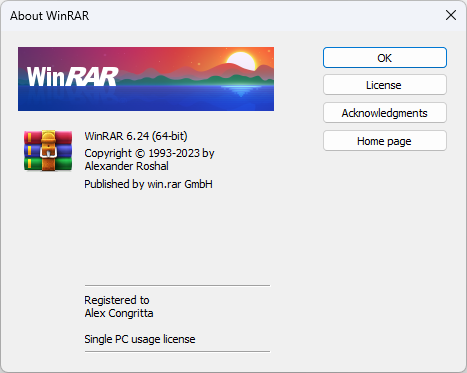

Ещё 2 года назад ко мне пришла мысль, что я хочу попробовать сделать так, что на моём компьютере не будет ни байта
пиратского контента, в т.ч. софта. Есть в этом какая-то эйфория, когда ты что-то приобретаешь честно, а не крадёшь.
Ну и понеслась...

<!--truncate-->

## Пролог

2 года назад я задумался о покупке нового ноутбука для работы. Ну а раз так, я хочу, чтобы там всё было идеально.
Пусть у меня в жизни бардак, в т.ч. нет никакой личной жизни, но мой компьютер - моё святое. Пусть там всё будет
чисто, свежо и светло.

В феврале 2022 года я купил себе ноутбук, а там была предустановлена Windows 10. Хорошо, что лицензионные ключи от
Windows 10 подходили под Windows 11, поэтому я сразу же после покупки и первого запуска обновился на Windows 11. До
этого я ею ни разу не пользовался. И вообще в принципе никогда не пользовался купленной Windows.

Конечно не было заветной процедуры ввода ключа активации при установке Windows, ибо ключ вшит
в прошивку материнской платы (я его даже ни разу не видел). Винда при установке автоматически подтягивает этот ключ
и не спрашивает его. Тем не менее у меня уже есть лицензионная Windows 11 Home (жаль, что не Pro). И знаете, это
приятно, когда ты пользуешься лицензионной Windows, включая всё, что в ней предустановлено. Это вызывает какую-то
эйфорию, желание делать добрые дела и заставило меня взглянуть на суть платного софта по-иному.

## Первая купленная программа

В то время я работал в штате в компании и на свою зарплату мог спокойно позволить себе покупать любой софт (к этой
теме я ещё вернусь). Мне, как сотруднику, выдали рабочий компьютер (Macbook) и лицензии на нужное мне ПО. У нас каждого
сотрудника при устройстве на работу спрашивали, какой софт ему нужен и компания его оплачивала (если необходимость в
нём реально есть). Мне тогда сразу организовали годовую подписку на все продукты JetBrains (включая WebStorm,
который я очень люблю). Конечно это была корпоративная лицензия, делать этим вебштормом свои личные проекты мне
никто не запрещал.

В то время в конце февраля у нас в компании начался кризис, в связи с которым значительную часть штата, включая меня,
было решено сократить. Моя компания выплатила зарплату за отработанные дни + отпускные и я смог на эти деньги
какое-то время жить. Но да ладно, сейчас не об этом. В то время я задумался, что пора бы заниматься всерьёз личными
проектами и проектами моих клиентов (т.к. я снова на фрилансе), поэтому я обязательно куплю WebStorm. Конечно самое
время было его покупать когда доллар подскочил до 150 рублей, но я таки его купил (годовую подписку).

Знаете, я снова испытал это чувство кайфа: у меня есть свой персональный JetBrains-аккаунт, под которым я могу
залогиниться на официальном сайте, скачать от туда редактор и активировать его своим личным ключом.

## Покупка ПО в условиях санкций

Когда стала заканчиваться моя годовая подписка на WebStorm, я понял, что продлить её никак не могу. Я писал в
поддержку, что, мол, давайте куплю самому себе подарочную карту или оплачу криптовалютой - не помогло. Я даже решил
попробовать получить продукты JetBrains бесплатно: у них на сайте была информация, что разработчики открытого ПО
могут получить лицензию на любой нужный редактор. Я решил выдвинуть один из своих пет-проектов как это самое
открытое ПО, подогнал его под все критерии и подал заявку в JetBrains. Итог: ждал ответ 2 недели, позже ответили,
что называется, по скрипту, что, мол, лицензию предоставить не можем.

Ну окей, отойдём от WebStorm. Весной 2023 года я решил купить себе Minecraft. Это оказалось не так сложно, т.к. я с
2013 года знал, что майнкрафт можно купить двумя способами - оплатить прямо на сайте или активировать подарочный код.
Я просто нагуглил, где эти коды можно купить, купил и активировал Minecraft на своём Microsoft-аккаунте. Теперь у
меня есть лицензия на Minecraft Java и Bedrock Edition.

Осенью 2023 года я купил себе хороший дорогой ноутбук с мощной видеокартой. В то время я задумался по поводу того,
что я никогда не играл в эту вашу GTA 5 и это надо быстро исправить. До этого я почти вообще не играл в компьютерные
игры и никогда не пользовался стимом и другими площадками для покупки игр.

В то время я играл с другом в одну бесплатную игру, которую нужно скачивать из Epic Games. Так я познакомился с этой
площадкой. И в один день я понял, что GTA 5 в России официально не продаётся, поэтому надо искать альтернативы.
Нашёл какую-то игру за 500 с чем-то рублей и решил купить. Как оказалось, игры в Epic Games вполне можно покупать в
России даже сейчас (на момент написания статьи) (платил я через Qiwi без каких-либо VPN). Игра оказалась дерьмом.

Примерно в то же время я общался со своим другом, с которым я хотел начать играть в одну игру по сети. Но чтобы
играть по сети, там обязательна лицензия, поэтому я решил купить лицензию и себе и ему. Игра продавалась в России,
поэтому покупка игры не составила никаких проблем. Но во время покупки игры на его Stream-аккаунт я обнаружил, что
аккаунт был зарегистрирован в другой стране, где действительно когда-то мой друг жил.

Ко мне в голову пришла гениальная идея - у него на аккаунте можно покупать игры, которые не продаются в России. А
ещё в Steam можно покупать игры в подарок. И я чуть позже забрал Stream-аккаунт у моего друга, а ему купил лицензию
на другой его аккаунт. (Просто так в настройках аккаунта поменять страну нельзя). Одной прекрасной ночью я купил на его
аккаунт ту самую GTA 5, а потом подарил её на свой основной Российский аккаунт. И это сработало! Я играл в неё до
самого утра.

## Переломный момент

Уже тогда я чётко решил, что отныне на моём компьютере не будет ничего пиратского. Я начну потихоньку замещать весь
пиратский софт лицензионным.

Игры покупать я научился, с этим проблем нет. Но что делать с теми, которые никак не принимают оплату из России,
даже с VPN? Правильно - нужно мутить иностранную банковскую карту. Я нередко работаю с заказчиками из Европы, США и
других стран и я держу с ними хорошие приятельские отношения, поэтому я всегда могу попросить их что-нибудь мне
купить. Но мне то денег не хватало, то у заказчика дел и так завал, поэтому нужно как-то самому решать проблему.

Оказываются, есть сервисы, которые за плату выпускают иностранные банковские карты специально для обхода санкций и
оплаты зарубежных сервисов. Есть предоплаченные карты, есть обычные дебетовые карты, которые можно пополнять с Qiwi
и других Российских платёжных систем. Я себе одну такую карту купил и пользуюсь ею уже несколько месяцев. Я так
обрадовался, когда вновь могу оплачивать сервера на Digital Ocean, AWS и других провайдерах.

Поэтому на такую карту, имя владельца которой, между прочим, Alex Congritta с американским billing address, я купил
несколько дешёвых платных программ на Google Play (с VPN), купил Minecraft на Google Play и вновь купил WebStorm.

Я официально пришёл к тому, что я не боюсь санкций при оплате чего-либо в любом цифровом магазине мира.

## Гулять, так гулять

В течение осени 2023 года я купил около 10 игр на Steam, суммарно потратив около 10 000 рублей. Другие игры покупать
я пока не хочу.

А ещё я решил купить себе антивирус Касперского (внезапно). С ним я знаком ещё с детства, когда даже не занимался
программированием. Помню когда мне было лет 7, мама принесла домой большую зелёную коробку с антивирусом. Там был
диск и был ключик активации. И его так сладко можно было активировать... Я понял, что в свои 24 годика я должен это
повторить, уже самостоятельно. Правда покупать коробку с диском и ключиком уже не надо. Достаточно зарегистрировать
аккаунт, в личном кабинете оплатить лицензию, а потом скачать программу и войти из-под неё в свой аккаунт. Я купил
антивирус сразу на год, а вместе с ним ещё и Password Manager и Secure Connection (VPN от Касперского).

Кроме антивируса я проплатил себе Telegram Premium на год. Просто так, для души.

А ещё купил Яндекс Плюс на год. Яндекс 360 не стал покупать. Кинопоиск у них, конечно, страдает малым выбором того,
что можно посмотреть, но музыку я стал слушать на Яндекс Музыке. Я даже не поленился и потратил несколько часов,
чтобы перенести 400 с чем-то треков из моего пиратского плейлиста в Яндекс Музыку.

И вот казалось бы, я пришёл к своей цели. У меня на компьютере не осталось ничего пиратского. Все игры, все
программы, которыми я пользуюсь, куплены. А Windows была установлена на моём ноутбуке производителем (ключик от
винды напечатан на днище ноутбука и он подходит при установке винды, скачанной с официального сайта).

В этой игре остался финальный босс - WinRAR. Стоит он, на минуточку, $30 или ~4000 рублей (смотря как и где покупать)
. Им я пользуюсь редко, но хороший архиватор мне нужен, т.к. Windows хоть и научилась открывать Zip и Rar-архивы,
она не сможет открыть такой архив, если он запаролен. А WinRAR я тоже знаю с детства. И я купил его.

## Что мы имеем

- **Windows 11 Pro** - 0 руб (установлена на ноутбуке производителем, я отдельно на Windows ничего не тратил)
- **WebStorm** - 8 878 руб
- **Minecraft на компьютер** - ~1200 руб
- **Minecraft на Android** - 900 руб.
- **GTA 5 (включая акульи карты и DLC)** - 9 633 руб
- **GTA Definitive Edition** - 4 500 руб.
- **Прочие игры на Steam и Epic Games** - 2 330 руб.
- **Telegram Premium на год** - 1 990 руб.
- **Яндекс Плюс на год** - ~1800 руб
- **Kaspersky Premium на год** - 2 039 руб
- **Kaspersky Secure Connection на год** - 1790 руб
- **WinRAR** - 4 193 руб

**Итого:** 39 253 рубля

## А зачем это всё?

Кто-то покупает ПО, чтобы быть уверенным, что оно без вирусов, в отличие от пиратского софта.

Кому-то важна возможность обратиться в поддержку производителя софта. Если ваш компьютер удовлетворяет системным
требованиям, но ПО у вас почему-то не работает, вы всегда можете обратиться в поддержку и вам помогут.

Но какие плюсы в покупке софта нашёл я для себя?

Я заметил, что совершая добрые поступки, я тренирую в себе силу воли и умение отдавать. Есть люди, которые нуждаются
в деньгах и у них это вопрос выживания; есть люди, которые живут хорошо, но они не могут позволить себе купить то, о
чём долго мечтают. Есть те, которые знают цену деньгам и хотят жить хорошей, положительной жизнью: питаться
натуральными и качественными продуктами, ходить в хорошей тёплой одежде, в меру развлекать себя и посвятить свою
жизнь спорту, науке, искусству и многим другим вещам, которые им нравятся. Есть же люди, которые не осознали цену
денег и беспорядочно тратят их на всё подряд, в т.ч. питаются на десятки тысяч рублей в день, одеваются в одежду,
самым дорогим в которой является логотип известного бренда и т.д. При этом такие люди, зачастую, очень жадные и хитрые.

Я же для себя понял, что нужно уметь помогать и отдавать. Это влияет на душевное равновесие, на отношение к миру и к
собственному достатку. Мне нравится ощущать себя морально сильным человеком. Если мне нужен архиватор - я возьму и
куплю его, я не буду воровать. Также если я хочу кушать, я пойду в магазин и куплю еду вместо того, чтобы её воровать.

Если человек бедный и не может заработать на пропитание - он идёт и ворует еду. Если он будет делать так постоянно,
он привыкнет к этому. Поймёт, что нет смысла развиваться духовно и нравственно. Зачем чего-то добиваться и к чему-то
стремиться, если можно просто одеться так, чтобы слиться с толпой и пойти на рынок, нахватать продуктов и убежать?
Для него вся его жизнь - это обманывать людей, прятаться от правосудия и не доверять никому.

Если дать этому человеку возможность зарабатывать. Причём так, чтобы ему это не приносило усталость и стресс, он, с
большой вероятностью, поменяет жизнь мелкого преступника на жизнь обычного порядочного человека. Ему больше не
придётся прятаться, он поймёт, что зарабатывая больше, можно купить больше еды, лучше одежду или переехать в более
красивое и уютное место. Благие условия всегда меняют людей в лучшую сторону.

Мне же нравится слушать музыку, которую я оплатил. Играть в игры, которые я купил на компьютере, который я купил.
Мне нравятся рекламные ролики этих игр/программ. Они красивые, с приятной музыкой, с анимациями. Ну разве не стоит
поблагодарить команду людей, которые всё это сделали? Разве они не заработали деньги, которые я плачу за лицензии?

Не хочу себя нахваливать, но я рад, что я не жадный, всегда помогаю людям финансово или поступками. Я никогда не
откажу человеку в помощи, если я вижу, что она ему нужна и действительно принесёт человеку пользу и опыт. Я всегда
заплачу человеку, если он честный, хорошо относится к работе или дарит мне приятные эмоции. Я часто плачу чаевые
таксистам или курьерам, если их работа сделана безупречно.

Кстати было бы интересно предложить долларовому миллиардеру Биллу Гейтс, ради благотворительной акции, на одни сутки
сделать Windows 11 Pro стоимостью всего в $1. Совсем бесплатно не надо, люди должны именно потратить деньги. Мне
было бы интересно понаблюдать за людьми и за их ощущениями от того, что они купили то, что они могли бы достать
бесплатно, но это было бы не честно
