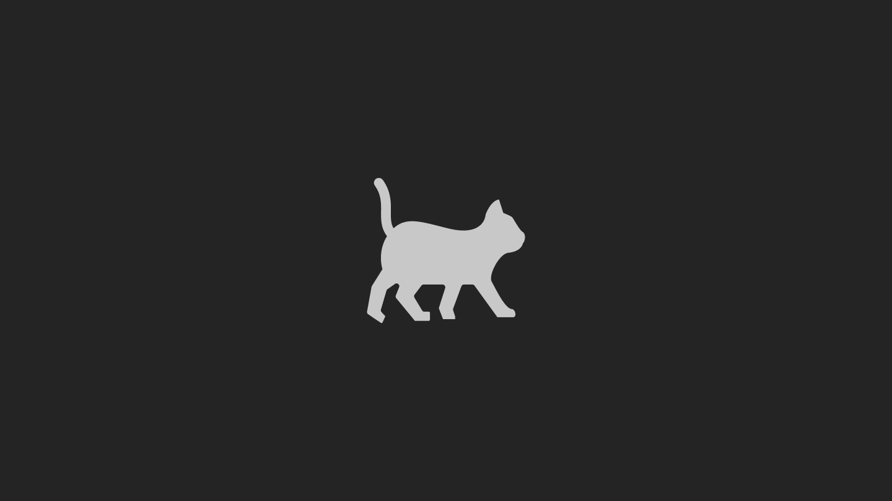

Сегодня у меня или у моего блога не круглая дата, чтобы тут подводить итоги и строить планы. Однако есть кое-что,
что копится у меня уже несколько месяцев и мне бы хотелось об этом рассказать

<!--truncate-->

## Первое: я сдался

Я не профессиональный контент-менеджер и я признаю, что мне не получилось построить хоть сколь популярный блог, не
прибегая к закупке рекламы. Что ж, я закупил рекламу в нескольких Telegram-каналах и мне удалось удвоить количество
подписчиков в моём Telegram-канале: с 18 до 39. Правда далось мне это ценой около 7000 потраченных рублей, что не
так жалко, но дало меньший результат, чем я ожидал.

У меня среди знакомых есть профессиональный таргетолог и я обсудил с ним эту ситуацию. Он, как и некоторые другие
люди, сказал, что я занимаюсь хернёй. Мол зачем закупать рекламу в проект, который заведомо не будет приносить прибыль.

Рекламу до этого я ни разу в жизни не закупал. Это делали мои заказчики, которым я делал проекты, но в дела рекламы
я не лез, поэтому знания об этом у меня были только теоретические.

Признаюсь: у меня нет особого желания вести этот блог, потому что я делал его в первую очередь для души: чтобы
делиться достижениями, строить планы и делиться этим с моей аудиторией. У меня нет планов превратить блог в
контентную помойку ради тупой продажи рекламы. В итоге я пришёл к тому, что я почти год веду блог и у меня
абсолютный 0 общения со своей аудиторией.

Возможно кто-то подумал, что этот пост последний в этом блоге, но нет, я буду и дальше выкладывать для кого-то хрень,
для кого-то вдохновляющий контент, для кого-то обучающие статьи.

## Работа над ошибками

### Без лишних слов:

- Я закрываю свой фреймворк Yet Another HTTP, которому уже около года. Кто не знает - это мой HTTP-фреймворк на
  замену Express.JS. У меня получился классный фреймворк, его хвалят мои приятели-разработчики и он очень хорошо
  показал себя в нагруженном продакшне проектов моих заказчиков. Я его закрываю, т.к. считаю его не идеальным:
  например можно было бы обойтись вообще без зависимостей, включая axios и formidable. А ещё там почему-то нет
  никакого вывода ошибок в консоль. Невероятно трудно дебажить приложения, когда ошибки не выводятся в консоль и
  приходится открывать третий глаз, который на лбу, чтобы быстро детектить возможные причины ошибок и устранять их.

  Сразу сделаю ремарку, что код фреймворка в скором времени больше не будет доступен на GitHub, а на NPM помечу
  фреймворк устаревшим (deprecated). Тем не менее, все запущенные на этом фреймворке проекты продолжат работать
  неограниченный срок и моё вмешательство в этом случае не требуется.

  На место Yet Another HTTP уже готовлю новый HTTP-фреймворк, название которого я пока не скажу. Но у меня из фич будет
  zero-dependency, то есть зависимостей у проекта не будет вообще и он будет работать только на стандартных
  библиотеках NodeJS. А ещё это самый быстрый HTTP-фреймворк под NodeJS из всех, что я знаю. Фреймворк так то уже готов
  и его исходники находятся у меня на рабочем компьютере. Он уже умеет самостоятельно читать POST-запросы (включая
  загрузку файлов) и обрабатывает запросы на ввод/вывод максимально быстро и без лишней работы.

  Фреймворк выйдет в паблик ориентировочно в январе 2024 года;

- Я закрываю фреймворк Congritta UI и всю его экосистему. На его место готовлю новый фреймворк с немного другой
  философией и подходу к написанию кода. Все запущенные проекты на Congritta UI продолжат работать неограниченный срок;

- Я удалю свои GitHub-репозитории, исходный код на которых заброшен и я не желаю его кому-либо демонстрировать.

### Что случилось? Почему такие радикальные действия?

Я решил морально умереть и возродиться с другим бэкграундом. Мне не нравится, что за почти год существования блога
вышло всего чуть больше десятка статей И НЕ ЗАПУЩЕНО НИ ОДНОГО ПЕТ-ПРОЕКТА.

Что касается фреймворков, которые я собираюсь закрыть: они оба писались на скорую руку прямо во время разработки
реальных проектов. То, что запущенные проекты моих заказчиков работают хорошо, является следствием понимания
ответственности и решение проблем ещё до того, как они могут появиться. Ибо, как говорится, чтобы хуярить сразу в
продакшн, нужно либо слишком мало мозгов, либо слишком много мозгов. У меня что-то одно из этого.

Я решил закрыть фреймворки, потому что они являются двумя китами, на которых стоят все проекты, что я делаю. А
раз так, мне нужно выложиться на 100%, чтобы они получились просто идеальными. А мне легче делать что-то идеальное с
нуля, чем из неприятной субстанции делать конфетку.

К тому же за год я поднабрался опыта и я смотрю на свой код годичной давности как на 5-кратное переваренный <...>. И
такое со мной каждый год. Думаю такое же есть у всех разработчиков.

Что касается запущенных пет-проектов, с ними я ничего делать не буду. Ни закрывать, ни обновлять. Ибо чтобы там
что-то поменять, лучше их переписать под ноль. Но раз так, проще написать новый проект, чем бесконечно вылизывать
имеющийся.

## О съёмке видео

Ещё несколько месяцев назад я объявил в своём Telegram-канале, что на 30 подписчиков я запишу какое-нибудь видео на
YouTube. Я сдержу своё слово и сниму его. Но дело в том, что у меня очень мало времени на съёмку видео. Ибо почему в
моём блоге статьи в среднем выходят раз в месяц? - Я не хочу постить статьи по типу "Как установить NodeJS" или "как
сделать анимацию в React", т.к. это итак можно нагуглить. Я хочу постить авторские интересные статьи в первую
очередь о разработке, об IT-бизнесе и вообще о всём, что связано с IT. На написание каждой статьи у меня уходит
около 6 часов (без учёта времени на придумывание идеи). Я вижу статью и с позиции автора, и с позиции читателя. Я
хочу, чтобы статья получилась полной, без повторений, но в то же время понятной и интересной каждому.

На съёмку ролика на YouTube я потрачу большие времени, т.к. нужно придумать оригинальную идею, написать сценарий,
текст, записать футажи и смонтировать. На монтаж может уйти только пол дня, если ролик минут на 5-10.

## О будущем блога

Я продолжу вести свой блог. Веру в то, что я обрету большую аудиторию не приложив усилий к продвижению блога, я
потерял. Даже не знаю, стоит ли вкладываться в продвижение, ибо никто не знает, вникают ли вообще люди в то, что я
пишу; читают ли они каждую статью или читают только заголовки. Если я закуплю ещё 50-100 людей на канал, будет ли у
меня преданная аудитория, которая способна понимать меня и то, что я пишу. Или стоит оставить как всё есть и писать
пока что для 40 человек, которые у меня сейчас есть? А может реально превратить его в контентную помойку и
зарабатывать на рекламе? 🤔

В ближайшее время, думаю, закупать аудиторию нет смысла, т.к. мне не особо есть чем похвастаться и новоприбывшие не
поймут кто я и что я. Думаю нужно написать больше статей, выпустить пет-проекты, записать ролики для YouTube и
попробовать ещё раз.

А, и да, надо мутить новый сайт. Ибо все соки из докусауруса (на чём работает мой блог) я почти выжал. Докусаурус
вообще не предназначен для того, чтобы вести на нём блоги
