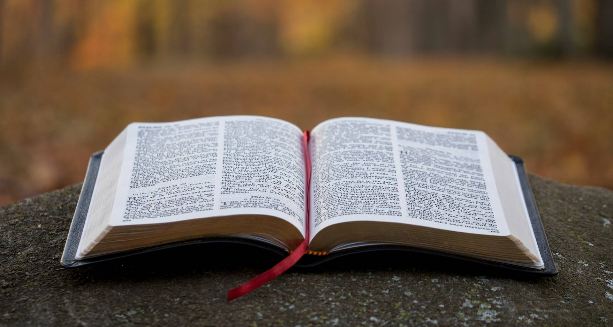

Многое ли вы знаете о Боге, в которого вы, возможно, верите? Что для вас вообще есть вера в Бога? Нет, в этой статье
я не буду навязывать конкретную веру или атеизм, человек волен сам выбирать во что верить. В этой статье я хочу лишь
порассуждать на эту тематику

<!--truncate-->

## Перед началом стоит учесть, что:

1. В этой статье я не буду принижать/восхвалять группы верующих/неверующих людей;
2. Статья не несёт в себе цели кого-либо оскорбить или задеть чьи-либо чувства;
3. Статья не несёт в себе цели заставить вас поменять своё вероисповедание или отказаться от веры/принять веру;
4. В этой статье я буду расписывать то, как вижу религию и веру я. Я подчёркиваю, что в этом плане я могу быть в
   чём-то не прав, в чём-то заблуждаться или задеть чьи-то чувства. Но, как и все люди в нашем цивилизованном
   обществе, я имею право на своё мнение и имею право выражать своё мнение, чем я и буду заниматься в данной статье.
   А вы можете выразить своё мнение в комментариях у меня в [Telegram-канале](https://t.me/congrittaBlog), где выходят
   анонсы статей и мелкие новости обо мне. Будьте уважительны к мнению других людей и если вы с ним не согласны,
   адекватно
   аргументируйте;

## Как я познакомился с религией

Не буду долго тянуть, сразу к делу - мои родственники (не все) исповедовали православие. Но эта вера всплывала
только если возникали какие-то проблемы или переживания. В обыденной в жизни о вере никто не вспоминал. Никто не
соблюдал заповеди, не проводил молитвы (опять же, молитвы были только если что-то уже случилось). Никто толком не
знал, что вообще такое Бог, зачем он существует и почему он "обязан" помогать людям. Его все воспринимали как некого
дядьку, которого не видно, не слышно, но он в любой момент просто так готов прийти на помощь.

Я же никогда не был по-настоящему верующим. В детстве моя бабушка рассказывала мне про Бога, Божью Мать, Николая
Угодника и т.д., но я их всех воспринимал максимум как Деда Мороза или других несуществующих личностей. Мол они
где-то там есть, моя жизнь с ними не пересекается, я ими не интересуюсь. Молиться в детстве я не умел и не хотел.
Что-то просить от всевышних сил я тогда не мог (возможно в силу возраста, потому-что я был ещё совсем ребёнком). А
молиться просто так я считал бессмысленным.

Уже лет с 8-9 я не общался со своими родственниками на тему религии. Причин этому не было, просто тема разговора
никогда не доходила до подобных тем. Ну и с тех пор я особо этим не интересовался. Помню, что во втором классе у
меня была девушка-друг (там всё сложно, но если в двух словах - друг у друга были во френдзоне). Она была для меня
прям верующим человеком - каждый день 2 раза заходила в молитвенные дома, знала там всех, молилась, читала
православную литературу и всем моим одноклассникам рассказывала как круто верить в бога. Не понимаю, кстати, что она
во мне нашла, ведь я в то время уже матерился, ссорился, ругался, дрался со всеми, а мои родители были краснее всех на
родительских собраниях. Но да ладно.

## Моя собственная религия

Как я уже сказал, я никогда особо не верил в "традиционного" Бога, не соблюдал заповеди, добровольно совершал грехи
и т.д. и т.п. Но жизнь у меня сложилась так, что я был одинок: и в садике, и в школе, и после школы. А от долгого
одиночества у людей развиваются шизофрения, паранойя и другие психологические заболевания.

Тем не менее, со школьных лет у меня есть чёткая уверенность в том, что я появился на свет не просто так, а с
определённой миссией. Мою жизнь курируют специально выделенные мне Боги (да, их несколько и они равноправны) и
строят мою жизнь так, чтобы я попадал в различные события, чтобы меня к чему-то подготовить (а в последствии - к
главной миссии в моей жизни (пока не знаю что это будет (или уже есть))). Такой взгляд сформировался у меня не
сразу - с течением жизни и развитием моих психологических отклонений, я часто менял своё мнение о своей жизни и о своих
богах. Думаю в этой статье нет смысла описывать полную хронологию моих мнений, там нет чего-то прям интересного.

Хотя есть одно мнение: лет с 12 мне почему-то понравилось число 21. Оно стало моим самым любимым числом и я многое с
ним связывал. Я безумно фанател от этого числа и думал, что как раз таки, когда мне исполнится 21 год, в моей жизни
произойдёт полный переворот и будет несколько вариантов:

- Я умру даже не заметив этого;
- Я встречусь со своими Богами и они мне расскажут зачем я родился и покажут мне полную хронологию моей жизни, так
  сказать, за кадром;
- Я к тому времени стану самым успешным человеком на планете (хотя бы чём-то конкретном). Например самым богатым или
  самым влиятельным или самым известным или оставлю после себя самый значимый след в истории человечества.

Вы даже представить себе не можете как я жил эти 9 лет. Моя жизнь в разной степени менялась, я переезжал, я закончил
школу, я заработал свои первые деньги на фрилансе, я сумел самостоятельно, как это говорится, без мам, пап и
кредитов переехать в другой город. Мне исполнилось 18 лет, я участвовал в стартапах, я заработал первую сотню тысяч
рублей и всё меньше времени оставалось до 21 года. Я анализировал последние события своей жизни и гадал, что же
произойдёт в ту ночь, когда мне исполнится 21 год.

С течением своей жизни я ментально "общался" со своими богами, обсуждал с ними мои планы на жизнь и узнавал у них,
почему, допустим, мне сегодня не повезло и почему мне вообще никогда не везёт. А в другие дни у меня всё было хорошо
и было хорошее настроение и я рассуждал со своими богами, за что это мне и почему.

Однажды таки случилась та самая ночь, которую я ждал 9 лет - мне исполнился 21 год. Думаю лучше оставить в тайне, где
я тогда был и чем занимался, но, как видите, я не умер и не стал самым богатым. На самом деле ничего мистического не
произошло. Была обычная ночь, которая могла быть у любого обычного человека. Тогда у меня было 4 мысли:

- Если мои боги всё таки есть, могли бы по приколу явить какое-нибудь чудо в ту мою ночь. Ибо ждал же 9 лет и они
  это видели. А так обидно;
- Возможно, они передумали что-либо со мной делать. По каким-либо причинам, не знаю каким;
- Возможно процесс уже запущен, просто я о нём ещё не знаю. Мне не хватает моего человеческого восприятия, чтобы
  понять это;
- Возможно это всё мои бредни и моих богов нет. Я могу просто жить дальше и уже не думать о них.

Моя жизнь пошла дальше. Пошла обычным человеческим путём. Я по-прежнему общался с людьми, делал веб-проекты,
зарабатывал деньги и удовлетворял свои потребности различной степени. Однако верить я продолжил и, забегая вперёд,
не перестал.

## Как я отношусь к вере

Многие люди разных вероисповеданий разговаривали со мной на тему того, чтобы я уверовал. Мол где-то есть Бог,
который меня любит, который мне поможет и который готов простить мне грехи. Главное - верить в него, молиться и
соблюдать заповеди. Я одно время даже состоял в одной христианской церкви (там все прекрасно знали, что я не верующий,
но я просто ходил туда ради компании людей. В этой церкви было, кстати, хорошо. Там пастырь достаточно понятно и
интересно рассказывал моменты из библии, мог ответить на любые вопросы о христианстве (даже если эти вопросы отрицают
существование Бога). Мне было интересно туда ходить, потому что даже если Христианство - полная выдумка, то всё таки
есть некая библия, в которой описан вариант появления человечества и есть некоторые сущности, которые есть только
внутри этой библии. И её можно с интересом читать как художественную литературу.

Вообще, как я понял, в распространённых в мире религиях есть такая штука, как заповеди. Это, как я понял, список
того, что можно делать, а что нельзя. Например нельзя материться, потреблять много пищи, заниматься сексом не в
браке, воровать, убивать и т.д. Я их никогда не соблюдаю, но не назло "Богу" (хотя если я в него не верю, наверное я
не в его юрисдикции), а потому что не хочу себя ограничивать по жизни. Мне нравится жрать, материться и трахаться и
не вижу причин отказываться от этого. Если Бог есть, то он и так понимает, что это не на зло. Мне не нужно ему об
этом лишний раз говорить или извиняться. Тем не менее, я знаю, зачем заповеди существуют: отчасти для того, чтобы
быть морально сильным и не деградировать свою жизнь только до удовлетворения своих низменных потребностей. Нужно не
давать быстрому кайфу закрыть собой взгляд на более светлые и благородные вещи в своей жизни. И с этим я согласен.
Вредные привычки в моей жизни есть, но они не занимают в ней ключевую роль и я считаю, что делаю свою норму
благородных дел (по крайней мере для себя).

А что касается молитв, их я никогда не понимал (но не говорю, что они ненужны. Я просто их не понимал). Не знаю как
молятся все и как правильно молиться, но я не хочу для этого ставить специальную атмосферу и вставать в специальную
позу. Я так же не хочу произносить свою молитву. Если Бог есть - он и так видит мою жизнь, он в курсе всех событий и
он сам знает, что мне нужно и с чем мне помочь. На крайняк я могу быстро послать ему ментальный сигнал об этом.

В моей же религии, которая существует только для меня и я не мог бы её кому-то проповедовать, нет заповедей и нет
молитв. У меня есть настоящий выбор (в отличие от Христианства, где человек вроде как волен выбирать, а вроде и
обязан жить по заповедям) и я всегда могу скатиться до удовлетворения низменных потребностей, если захочу. А могу и
заниматься благородными вещами (для себя или для всех остальных). За все плохие поступки в своей жизни я в любом
случае отвечу, а за хорошие мне обязательно воздастся, ибо их я делаю только если вижу в этом пользу для себя или
окружающих.

## Что недавно я понял

Я задумался о том, почему иногда снятся вещие сны или почему некоторые люди рассказывают, что молитвы им помогают.
Мне самому часто в течение жизни снились сны, которые потом сбывались. И этому я долго не мог найти объяснения.

Но я решил подойти к этому с прагматичной точки зрения:

Допустим, человеку приснилось, что он живёт в другой квартире, хотя переезжать он не собирается. Но тут что-то в его
жизни случается и он переезжает. И внезапно оказывается, что он заселился именно в ту квартиру, которая ему снилась.
Как такое возможно?

А всё просто. У каждого человека есть мировоззрение. В т.ч. каждый человек живёт в таком аквариуме, где в центре его
голова, а вокруг все убеждения, доводы, мнения о людях, мечты и т.д. Что-то из этого человек обдумывает активно, а
что-то - крутится в его подсознании (то есть то, о чём ты прямо сейчас подумать не можешь и не сможешь).

Если человеку приснился переезд, значит поводы для этого возможны и он это прекрасно осознаёт (например увольнение с
работы или, наоборот, повышение доходов и переезд в более комфортные условия). Ведь недавно до этого сна человеку
могли намекнуть, что его повысят в должности или поднимут зарплату, а человек мог даже забыть про этот намёк. То
есть на уровне подсознания это осталось, а на уровне "быстрой памяти" это уже исчезло. (Типа, знаете, когда резко
что-то вспомнил и такой "Ааааа..., этоо"). А куда человек (чаще всего) захочет потратить заработанные деньги? Либо на
айфон, либо на переезд, либо на новую одежду. Соответственно только от одного намёка на повышение зарплаты, человеку
в ближайшую ночь могут присниться либо квартира, либо айфон, либо одежда. Он даже никогда не поймёт, почему ему
именно это приснилось.

Окей, человек решил переехать. Он начнёт листать список объявлений о сдаче жилья. Какое жильё он будет выбирать? То,
которое ему нравится (по дизайну, по району или по расположению). А какое жильё ему приснится? Чаще всего то,
которое ему нравится (по дизайну, по району или по расположению). Так и получается, что человек заселяется в ту
квартиру, которая ему снилась. Вот тебе и механика вещих снов.

И тут я задумался: а что, если никаких богов и религий правда нет? Возможно для каждого верующего человека, его
религия, это просто его же подсознание и его же внутренний голос
